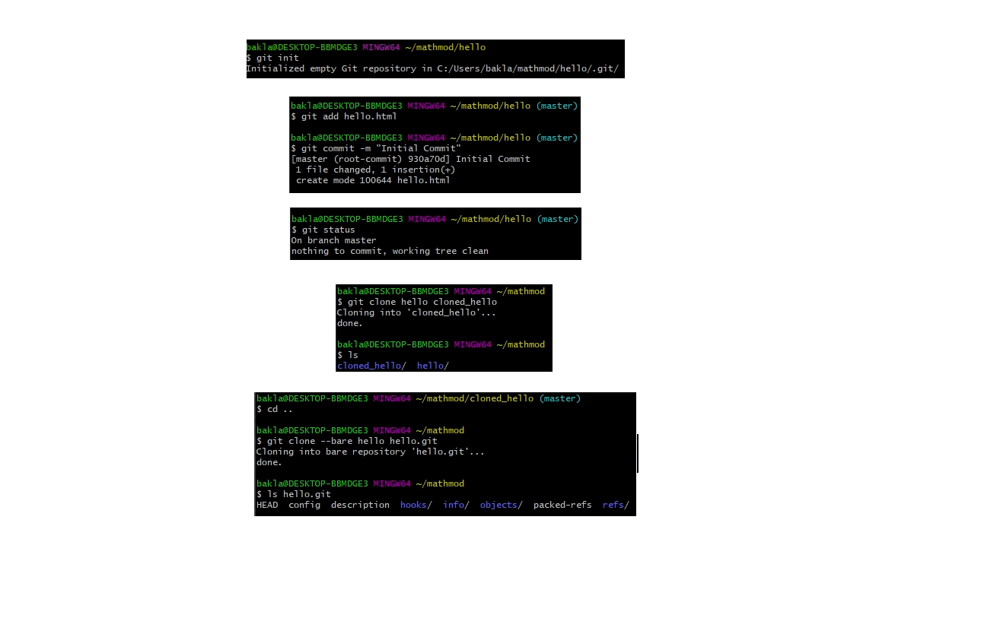
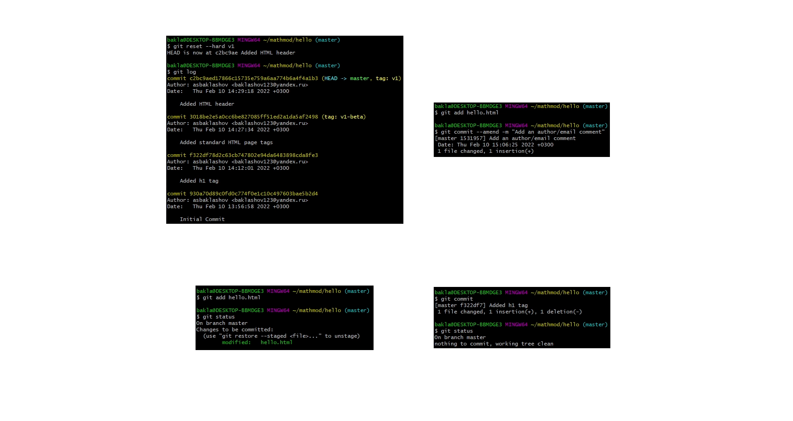
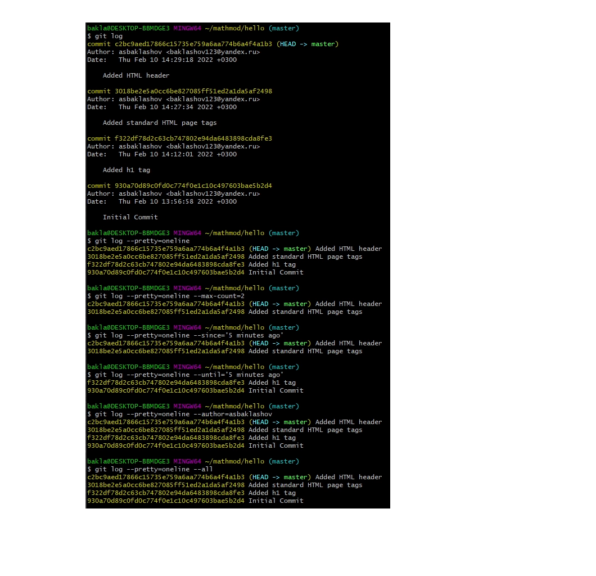
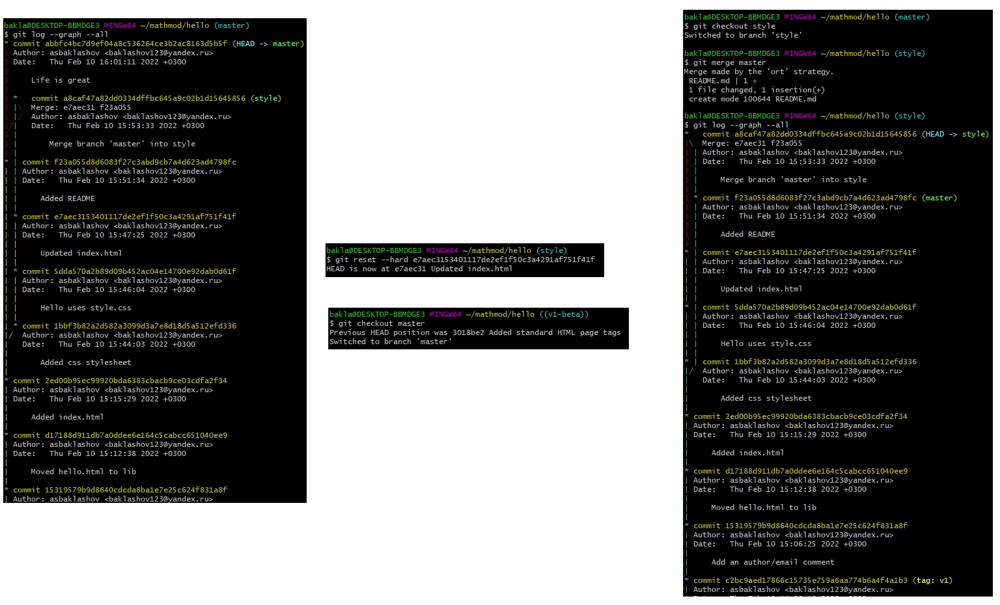

---
## Front matter
lang: ru-RU
title: Лабораторная работа №1. Работа с git
author: |
	Alexander S. Baklashov
institute: |
	RUDN University, Moscow, Russian Federation

date: 11 February, 2022

## Formatting
toc: false
slide_level: 2
theme: metropolis
header-includes: 
 - \metroset{progressbar=frametitle,sectionpage=progressbar,numbering=fraction}
 - '\makeatletter'
 - '\beamer@ignorenonframefalse'
 - '\makeatother'
aspectratio: 43
section-titles: true
---

# Цель работы

Ознакомиться с системой управления версиями git.

# Задачи

1. Научиться работе с репозиториями
2. Научиться работе с коммитами и индексацией
3. Научиться просматривать список произведенных изменений.
4. Научиться работе с ветками

## Работа с репозиториями

Научились создавать репозитории, добавлять фалйы в них, проверять их состояние, клонировать и создавать чистые репозитории. 

## Работа с коммитами и индексацией

Научились делать индексацию и коммит изменений, сбрасывать их, изменить предыдущий коммит.

## Список произведенных изменений

## Работа с ветками

Научились работе с ветками (переключаться между ними, слиять, просматривать, сбрасывать, создавать и т.д.)

# Вывод

В ходе данной лабораторной работы я ознакомился с системой управления версиями git.