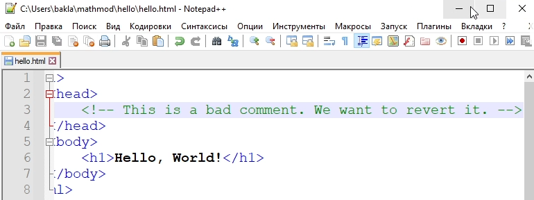
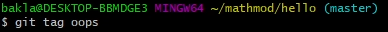
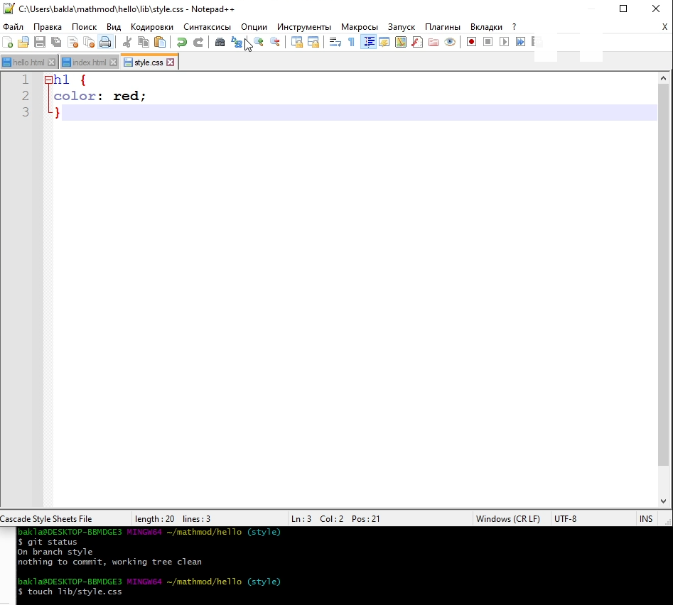
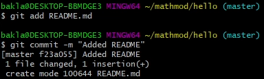
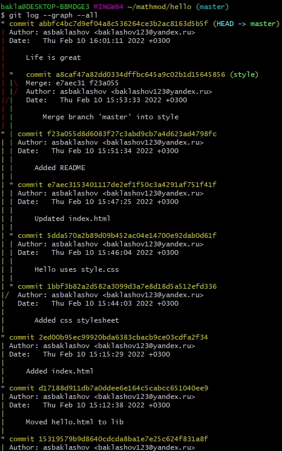
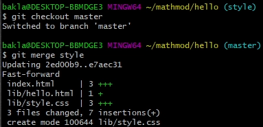
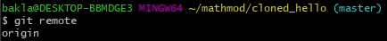
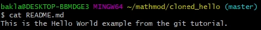

---
# Front matter
title: "Отчёт по лабораторной работе №1. Работа с git."
subtitle: "Предмет: математическое моделирование"
author: "Александр Сергеевич Баклашов"

# Generic otions
lang: ru-RU
toc-title: "Содержание"

# Bibliography
bibliography: bib/cite.bib
csl: pandoc/csl/gost-r-7-0-5-2008-numeric.csl

# References settings
linkReferences: true
nameInLink: true

# Pdf output format
toc: true # Table of contents
toc_depth: 2
lof: true # List of figures
lot: false # List of tables
fontsize: 12pt
linestretch: 1.5
papersize: a4
documentclass: scrreprt
## I18n
polyglossia-lang:
  name: russian
  options:
	- spelling=modern
	- babelshorthands=true
polyglossia-otherlangs:
  name: english
### Fonts
mainfont: PT Serif
romanfont: PT Serif
sansfont: PT Sans
monofont: PT Mono
mainfontoptions: Ligatures=TeX
romanfontoptions: Ligatures=TeX
sansfontoptions: Ligatures=TeX,Scale=MatchLowercase
monofontoptions: Scale=MatchLowercase,Scale=0.9
## Biblatex
biblatex: true
biblio-style: "gost-numeric"
biblatexoptions:
  - parentracker=true
  - backend=biber
  - hyperref=auto
  - language=auto
  - autolang=other*
  - citestyle=gost-numeric
## Misc options
indent: true
header-includes:
  - \linepenalty=10 # the penalty added to the badness of each line within a paragraph (no associated penalty node) Increasing the value makes tex try to have fewer lines in the paragraph.
  - \interlinepenalty=0 # value of the penalty (node) added after each line of a paragraph.
  - \hyphenpenalty=50 # the penalty for line breaking at an automatically inserted hyphen
  - \exhyphenpenalty=50 # the penalty for line breaking at an explicit hyphen
  - \binoppenalty=700 # the penalty for breaking a line at a binary operator
  - \relpenalty=500 # the penalty for breaking a line at a relation
  - \clubpenalty=150 # extra penalty for breaking after first line of a paragraph
  - \widowpenalty=150 # extra penalty for breaking before last line of a paragraph
  - \displaywidowpenalty=50 # extra penalty for breaking before last line before a display math
  - \brokenpenalty=100 # extra penalty for page breaking after a hyphenated line
  - \predisplaypenalty=10000 # penalty for breaking before a display
  - \postdisplaypenalty=0 # penalty for breaking after a display
  - \floatingpenalty = 20000 # penalty for splitting an insertion (can only be split footnote in standard LaTeX)
  - \raggedbottom # or \flushbottom
  - \usepackage{float} # keep figures where there are in the text
  - \floatplacement{figure}{H} # keep figures where there are in the text
---

# Цель работы

Ознакомиться с системой управления версиями git.

# Задание

1. Настроить git для первого использования.
2. Научиться создавать репозитории.
3. Научиться добавлять файлы в репозитории.
4. Научиться делать индексацию и коммит изменений.
5. Научиться просматривать список произведенных изменений.
6. Научиться просматривать предыдущие снимки из репозитория.
7. Научиться работать с тегами.
8. Научиться отменять локальные/проиндексированные изменения, а также отменять коммиты.
9. Научиться удалять коммиты из ветки.
10. Научиться вносить изменения в существующие коммиты
11. Научиться работе с файлами в рамках репозитория
12. Научиться работе с объектами git
13. Научиться работе с ветками (создавать, изменять, слиять, сбрасывать,  переключаться между ними и т.д.)
14. Научиться разрешать возникающие конфликты 
15. Научиться клонировать репозитории
16. Научиться извлекать изменения из удаленного репозитория
17. Научиться создавать чистые репозитории
18. Научиться добавлять удаленные репозитории
19. Научиться извлекать изменения из общего репозитория

# Теоретическое введение

Git — это система управления версиями исходного кода программ. Проект был создан Линусом Торвальдсом для управления разработкой ядра Linux, первая версия выпущена 7 апреля 2005 года. 

Среди проектов, использующих Git — ядро Linux, Swift, Android, Drupal, Cairo, GNU Core Utilities, Mesa, Wine, Chromium, Compiz Fusion, FlightGear, jQuery, PHP, NASM, MediaWiki, DokuWiki, Qt, ряд дистрибутивов Linux.

# Выполнение лабораторной работы

<!--- Описываются проведённые действия, в качестве иллюстрации даётся ссылка на иллюстрацию (рис. [-@fig:001]) 

{ #fig:001 width=70% } --->

## Подготовка
1. Установка имени и электронной почты
Выполним следующие команды, чтобы git узнал ваше имя и электронную почту (рис. [-@fig:001])

{ #fig:001 width=70% }

2. Параметры установки окончаний строк
Настроим core.autocrlf с параметрами true (рис. [-@fig:002])

{ #fig:002 width=70% }

3. Установка отображения unicode
Чтобы избежать нечитаемых строк, установим соответствующий флаг (рис. [-@fig:003])

{ #fig:003 width=70% }

## Создание проекта
1. Создадим страницу «Hello, World» (рис. [-@fig:004])

{ #fig:004 width=70% }

2. Создадим git репозиторий из каталога hello (рис. [-@fig:005])

{ #fig:005 width=70% }

3. Добавим файл в репозиторий (рис. [-@fig:006])

{ #fig:006 width=70% }

4. Проверим состояние репозитория 
Используем команду git status, чтобы проверить текущее состояние репозитория (рис. [-@fig:007])

{ #fig:007 width=70% }

## Внесение изменений
1. Изменим страницу «Hello, World» (рис. [-@fig:008])

{ #fig:008 width=70% }

Проверим состояние рабочего каталога (рис. [-@fig:009])

{ #fig:009 width=70% }

## Индексация изменений
1. Выполним команду git, чтобы проиндексировать изменения. Проверим состояние. (рис. [-@fig:010])

{ #fig:010 width=70% }

2. Коммит изменений

Сделаем коммит и проверим состояние (рис. [-@fig:011])

{ #fig:011 width=70% }

3. Добавим стандартные теги страницы (рис. [-@fig:012])

{ #fig:012 width=70% }

Добавим это изменение в индекс git (рис. [-@fig:013])

{ #fig:013 width=70% }

Теперь добавим заголовки HTML (секцию head) к странице «Hello, World» (рис. [-@fig:014])

{ #fig:014 width=70% }

Проверим текущий статус (рис. [-@fig:015])

{ #fig:015 width=70% }

Произведём коммит проиндексированного изменения, а затем еще раз проверим состояние (рис. [-@fig:016])

{ #fig:016 width=70% }

Добавим второе изменение в индекс, затем проверим состояние с помощью команды git status и сделаем коммит второго изменения (рис. [-@fig:017])

{ #fig:017 width=70% }

3. Получим список произведенных изменений и поэксперементируем с отображением лога (рис. [-@fig:018])

{ #fig:018 width=70% }

4. Получение старых версий (рис. [-@fig:019])

{ #fig:019 width=70% }

Используем хэш для первого коммита в команде git checkout. Затем проверим содержимое файла hello.html (рис. [-@fig:020])

{ #fig:020 width=70% }

Вернёмся к последней версии в ветке master (рис. [-@fig:021])

{ #fig:021 width=70% }

5. Создание тегов версий

Создадим тег первой версии (рис. [-@fig:022])

{ #fig:022 width=70% }

Создадим тег для версии, которая идет перед текущей версией и назовем его v1-beta (рис. [-@fig:023])

{ #fig:023 width=70% }

6. Переключение по имени тега

Попробуем попереключаться между двумя отмеченными версиями (рис. [-@fig:024])

{ #fig:024 width=70% }

7. Просмотр тегов с помощью команды tag

Просмотрим доступные теги и теги в логе (рис. [-@fig:025])

{ #fig:025 width=70% }

## Отмена локальных изменений (до индексации)

1. Переключимся на ветку master (рис. [-@fig:026])

{ #fig:026 width=70% }

2. Изменим hello.html (рис. [-@fig:027])

{ #fig:027 width=70% }

3. Проверим состояние (рис. [-@fig:028])

{ #fig:028 width=70% }

4. Отмена изменений в рабочем каталоге

Используем команду git checkout для переключения версии файла hello.html в репозитории (рис. [-@fig:029])

{ #fig:029 width=70% }

## Отмена проиндексированных изменений (перед коммитом)

1. Изменим файл и проиндексируем изменения

Внесём изменение в файл hello.html в виде нежелательного комментария (рис. [-@fig:030])

{ #fig:030 width=70% }

Проиндексируем это изменение (рис. [-@fig:031])

{ #fig:031 width=70% }

2. Проверим состояние (рис. [-@fig:032])

{ #fig:032 width=70% }

3. Выполним сброс буферной зоны (рис. [-@fig:033])

{ #fig:033 width=70% }

4. Переключимся на версию коммита (рис. [-@fig:034])

{ #fig:034 width=70% }

## Отмена коммитов

1. Изменим файл и сделаем коммит 
Изменим файл, добавив в него комментарий (рис. [-@fig:035])

{ #fig:035 width=70% }

Сделаем коммит (рис. [-@fig:036])

{ #fig:036 width=70% }

2. Сделаем коммит с новыми изменениями, отменяющими предыдущие (рис. [-@fig:037])

{ #fig:037 width=70% }

3. Проверим лог (рис. [-@fig:038])

{ #fig:038 width=70% }

## Удаление коммиттов из ветки

1. Проверим историю (рис. [-@fig:039])

{ #fig:039 width=70% }

2. Отметим ветку (рис. [-@fig:040])

{ #fig:040 width=70% }

3. Сброс коммитов к предшествующим коммиту Oops (рис. [-@fig:041])

{ #fig:041 width=70% }

4. Посмотрим на все коммиты (рис. [-@fig:042])

{ #fig:042 width=70% }

## Удаление тега Oops

1. Удалим тег Oops и коммиты, на которые он ссылался, сборщиком мусора. (рис. [-@fig:043])

{ #fig:043 width=70% }

## Внесение изменений в коммиты

1. Изменим страницу, а затем сделаем коммит

Добавим в страницу комментарий автора (рис. [-@fig:044])

{ #fig:044 width=70% }

Сделаем коммит (рис. [-@fig:045])

{ #fig:045 width=70% }

2. Обновим страницу hello, включив в неё email (рис. [-@fig:046])

{ #fig:046 width=70% }

3. Изменим предыдущий коммит (рис. [-@fig:047])

{ #fig:047 width=70% }

4. Просмотр истории (рис. [-@fig:048])

{ #fig:048 width=70% }

## Перемещение файлов

1. Переместим файл hello.html в каталог lib (рис. [-@fig:049])

{ #fig:049 width=70% }

2. Коммит в новый каталог (рис. [-@fig:050])

{ #fig:050 width=70% }

## Подробнее о структуре

1. Добавление index.html

Добавим файл index.html в наш репозиторий (рис. [-@fig:051])

{ #fig:051 width=70% }

Добавим файл и сделаем коммит (рис. [-@fig:052])

{ #fig:052 width=70% }

## Git внутри: Каталог .git

1. Каталог .git (рис. [-@fig:053])

{ #fig:053 width=70% }

2. База данных объектов (рис. [-@fig:054])

{ #fig:054 width=70% }

3. Углубляемся в базу данных объектов 

Смотрим в один из каталогов с именем из 2 букв (aa) (рис. [-@fig:055])

{ #fig:055 width=70% }

4. Просмотрим Config File (рис. [-@fig:056])

{ #fig:056 width=70% }

5. Ветки и теги (рис. [-@fig:057])

{ #fig:057 width=70% }

Мы узнали хэш коммита v1

6. Файл HEAD (рис. [-@fig:058])

{ #fig:058 width=70% }

## Работа непосредственно с объектами git

1. Поиск последнего коммита (рис. [-@fig:059])

{ #fig:059 width=70% }

2. Вывод последнего коммита с помощью SHA1 хэша (рис. [-@fig:060])

{ #fig:060 width=70% }

3. Поиск дерева (рис. [-@fig:061])

{ #fig:061 width=70% }

4. Вывод каталога lib (рис. [-@fig:062])

{ #fig:062 width=70% }

5. Вывод файла hello.html (рис. [-@fig:063])

{ #fig:063 width=70% }

6. Исследуйте самостоятельно (рис. [-@fig:064])

Мы дошли до оригинального файла hello.html с самого первого коммита вручную по ссылкам SHA1 хэша в последнем коммите с помощью хэша parent'а каждого следующего коммита.

{ #fig:064 width=70% }

## Создание ветки

1. Создадим ветку (рис. [-@fig:065])

{ #fig:065 width=70% }

2. Добавим файл стилей style.css (рис. [-@fig:066])

{ #fig:066 width=70% }

Сделаем коммит этого файла (рис. [-@fig:067])

{ #fig:067 width=70% }

3. Изменим основную страницу (рис. [-@fig:068])

{ #fig:068 width=70% }

Сделаем коммит этого файла (рис. [-@fig:069])

{ #fig:069 width=70% }

4. Изменим index.html (рис. [-@fig:070])

{ #fig:070 width=70% }

Сделаем коммит этого файла (рис. [-@fig:071])

{ #fig:071 width=70% }

## Навигация по веткам

1. Просмотрим историю (рис. [-@fig:072])

{ #fig:072 width=70% }

2. Переключение на ветку master (рис. [-@fig:073])

{ #fig:073 width=70% }

3. Вернемся к ветке style (рис. [-@fig:074])

{ #fig:074 width=70% }

## Изменения в ветке master

1. Создадим файл README в ветке master (рис. [-@fig:075])

{ #fig:075 width=70% }

## Сделаем коммит изменений README.md в ветку master

1. Сделаем коммит изменений README.md в ветку master (рис. [-@fig:076])

{ #fig:076 width=70% }

2. Просмотрим текущие ветки и выявим отличия (рис. [-@fig:077])

{ #fig:077 width=70% }

## Слияние

1. Слияние веток (рис. [-@fig:078])

{ #fig:078 width=70% }

## Создание конфликта

1. Вернёмся в master и создадим конфликт (рис. [-@fig:079]) (рис. [-@fig:080]) (рис. [-@fig:081])

{ #fig:079 width=70% }

{ #fig:080 width=70% }

{ #fig:081 width=70% }

2. Просмотр веток (рис. [-@fig:082])

{ #fig:082 width=70% }

## Разрешение конфликтов

1. Слияние master с веткой style (рис. [-@fig:083])

{ #fig:083 width=70% }

2. Внесём изменения в lib/hello.html (рис. [-@fig:084])

{ #fig:084 width=70% }

3. Сделаем коммит решения конфликта (рис. [-@fig:085])

{ #fig:085 width=70% }

## Сброс ветки style

1. Найдём последний коммит перед слиянием (рис. [-@fig:086])

{ #fig:086 width=70% }

2. Сбросим ветку style к коммиту Updated index.html (рис. [-@fig:087])

{ #fig:087 width=70% }

3. Проверим ветку (рис. [-@fig:088])

{ #fig:088 width=70% }

## Сброс ветки master

1. Сброс ветки master (рис. [-@fig:089])

{ #fig:089 width=70% }

## Перебазирование

1. Перебазирование (рис. [-@fig:090])

{ #fig:090 width=70% }

## Слияние в ветку master

1. Слияние в ветку master (рис. [-@fig:091])

{ #fig:091 width=70% }

2. Просмотрим логи (рис. [-@fig:092])

{ #fig:092 width=70% }

Теперь ветки style и master идентичны.

## Клонирование репозиториев

1. Перейдём в рабочий каталог (рис. [-@fig:093])

{ #fig:093 width=70% }

2. Создадим клон репозитория hello (рис. [-@fig:094])

{ #fig:094 width=70% }

## Просмотр клонированного репозитория

1. Взглянем на клонированный репозиторий (рис. [-@fig:095])

{ #fig:095 width=70% }

2. Просмотрим историю репозитория (рис. [-@fig:096])

{ #fig:096 width=70% }

Вы видим ветку master (HEAD) в списке истории. Мы также ветку ветки с именами:origin/master, origin/style и origin/HEAD.

## Что такое origin?

1. Выполним git remote (рис. [-@fig:097])

{ #fig:097 width=70% }

2. Получить более подробную информацию об имени по умолчанию (рис. [-@fig:098])

{ #fig:098 width=70% }

## Удаленные ветки

1. Посмотрим на ветки, доступные в нашем клонированном репозитории (рис. [-@fig:099])

{ #fig:099 width=70% }

2. Список удаленных веток (рис. [-@fig:100])

{ #fig:100 width=70% }

## Изменение оригинального репозитория

1. Внесём изменения в оригинальный репозиторий hello (рис. [-@fig:101]) (рис. [-@fig:102])

{ #fig:101 width=70% }

{ #fig:102 width=70% }

2. Извлечение изменений (рис. [-@fig:103])

{ #fig:103 width=70% }

3. Проверим README.md (рис. [-@fig:104])

{ #fig:104 width=70% }

Клонированный файл README.md не изменился.

## Слияние извлеченных изменений

1. Сольём извлеченные изменения в локальную ветку master (рис. [-@fig:105])

{ #fig:105 width=70% }

2. Еще раз проверим файл README.md (рис. [-@fig:106])

{ #fig:106 width=70% }

## Добавление ветки наблюдения

1. Добавим локальную ветку, которая отслеживает удаленную ветку (рис. [-@fig:107])

{ #fig:107 width=70% }

## Чистые репозитории

1. Создадим чистый репозиторий (рис. [-@fig:108])

{ #fig:108 width=70% }

## Добавление удаленного репозитория

1. Добавим репозиторий hello.git к оригинальному репозиторию (рис. [-@fig:109])

{ #fig:109 width=70% }

## Отправка изменений

1. Отредактируем файл README.md (рис. [-@fig:110])

{ #fig:110 width=70% }

2. Сделаем коммит и отправим изменения в общий репозиторий (рис. [-@fig:111])

{ #fig:111 width=70% }

## Извлечение общих изменений

1. Извлечём изменения из общего репозитория (рис. [-@fig:112])

{ #fig:112 width=70% }

# Выводы

В ходе данной лабораторной работы я ознакомился с системой управления версиями git.