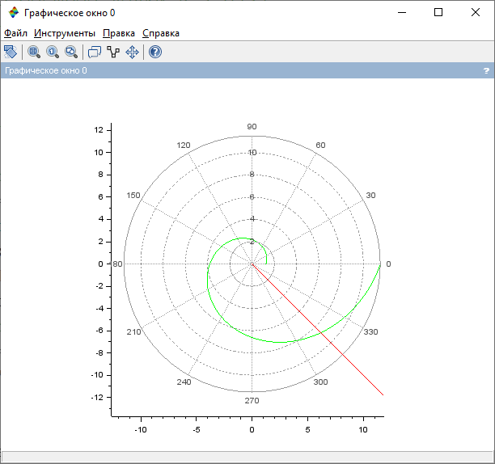
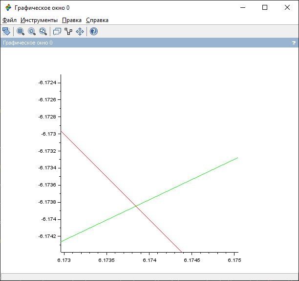
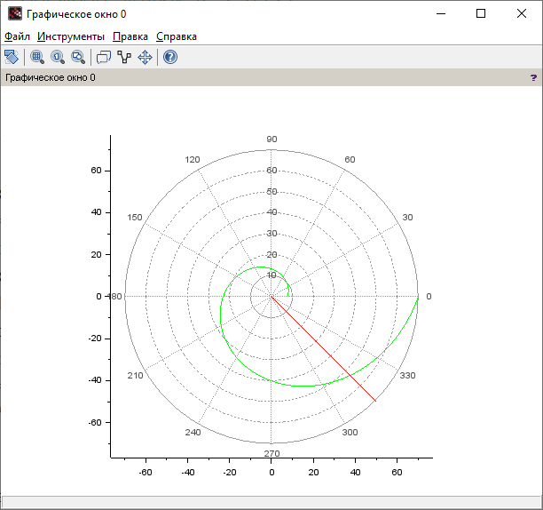
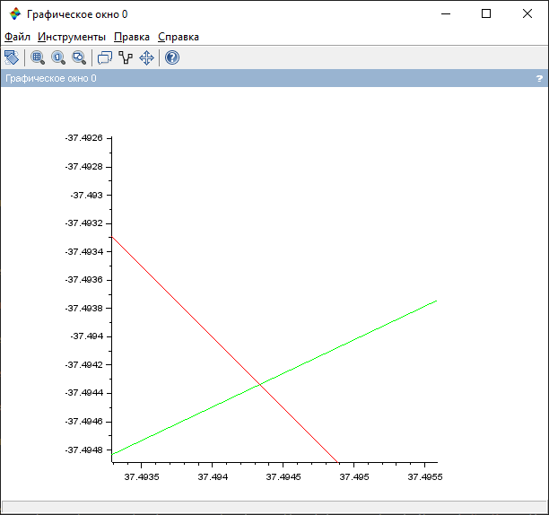
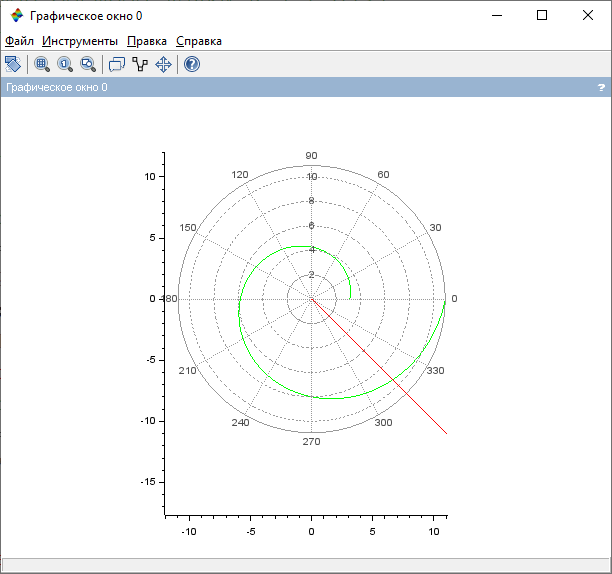
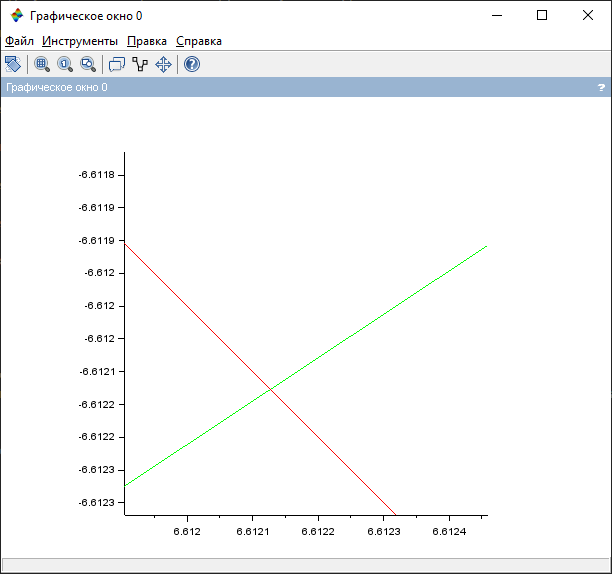
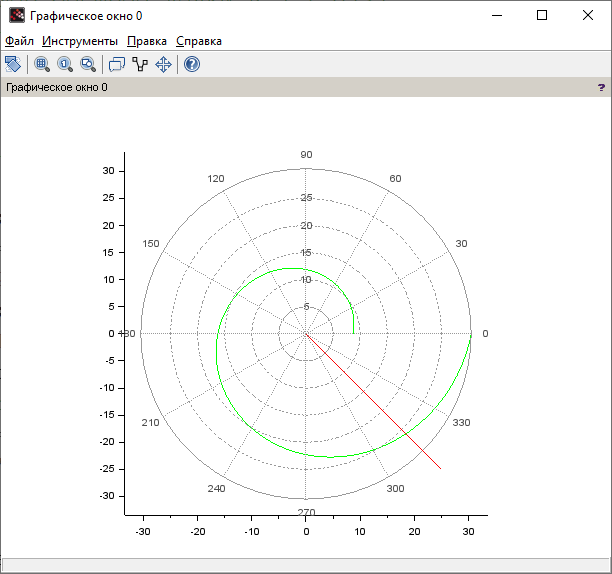
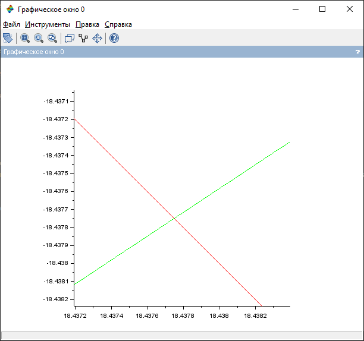

---
## Front matter
lang: ru-RU
title: Лабораторная работа №2. Задача о погоне
author: |
	Alexander S. Baklashov
institute: |
	RUDN University, Moscow, Russian Federation

date: 11 February, 2022

## Formatting
toc: false
slide_level: 2
theme: metropolis
header-includes: 
 - \metroset{progressbar=frametitle,sectionpage=progressbar,numbering=fraction}
 - '\makeatletter'
 - '\beamer@ignorenonframefalse'
 - '\makeatother'
aspectratio: 43
section-titles: true
---

# Цель работы

Рассмотреть пример построения математических моделей для выбора правильной стратегии при решении задач поиска. С помощью примера научиться решать задачи такого типа.

# Задачи

1. Провести аналогичные рассуждения и вывод дифференциальных уравнений, если скорость катера больше скорости лодки в n раз.
2. Построить траекторию движения катера и лодки для двух случаев.
Определить по графику точку пересечения катера и лодки
3. Записать уравнение, описывающее движение катера, с начальными условиями для двух случаев (в зависимости от расположения катера относительно лодки в начальный момент времени).
4. Построить траекторию движения катера и лодки для двух случаев.
5. Найти точку пересечения траектории катера и лодки.

## Задача

На море в тумане катер береговой охраны преследует лодку браконьеров.
Через определенный промежуток времени туман рассеивается, и лодка обнаруживается на расстоянии $k$ км от катера. Затем лодка снова скрывается в тумане и уходит прямолинейно в неизвестном направлении. Известно, что скорость катера в $n$ раз больше скорости браконьерской лодки.
Необходимо определить по какой траектории необходимо двигаться катеру, чтобы нагнать лодку.

## Аналогичные рассуждения

Проведя рассуждения, аналогичные рассуждениям, приведённым в лабораторной работе, при $n=3$, получили, что решение исходной задачи сводится к решению системы из двух дифференциальных уравнений. Исключив из полученной системы производную по $t$, перешли к следующему уравнению:

## Аналогичные рассуждения

$\frac {dr}{dϴ}$ = $\frac {r} {2\sqrt{2}}$

с начальными условиями

$$
\left\{ 
\begin{array}{c}
ϴ_0 = 0 \\
r_0 = x_1  
\end{array}
\right.
$$
или
$$
\left\{ 
\begin{array}{c}
ϴ_0 = -π \\
r_0 = x_2
\end{array}
\right.
$$

## Траектория движения катера и лодки, нахожение точки пересечения катера и лодки для двух случаев

Зададим начальные значения (такое же n (скорость катера больше скорости лодки в 3 раза)), как и в предыдущем пункте, но также зададим $k=5$):

$$
\left\{ 
\begin{array}{c}
k = 5 \\
n = 3 \\
\end{array}
\right.
$$

Отсюда получаем, что $x_1$ = $\frac {5}{4}$, $x_2$ = $\frac {5}{2}$

## Траектория движения катера и лодки, нахожение точки пересечения катера и лодки для двух случаев

Также, из этого получим начальные условия для 1 и 2 случая:

Для 1 случая:

$$
\left\{ 
\begin{array}{c}
ϴ_0 = 0 \\
r_0 = \frac {5}{4}
\end{array}
\right.
$$

Для 2 случая:

$$
\left\{ 
\begin{array}{c}
ϴ_0 = -π \\
r_0 = \frac {5}{2}
\end{array}
\right.
$$

## Траектория движения катера и лодки, нахожение точки пересечения катера и лодки для двух случаев

Для 1 случая:

{ width=50% }

## Траектория движения катера и лодки, нахожение точки пересечения катера и лодки для двух случаев

Для 1 случая:

{ width=50% }

## Траектория движения катера и лодки, нахожение точки пересечения катера и лодки для двух случаев

Для 2 случая:

{ width=50% }

## Траектория движения катера и лодки, нахожение точки пересечения катера и лодки для двух случаев

Для 2 случая:

{ width=50% }

## Задача

На море в тумане катер береговой охраны преследует лодку браконьеров. Через определенный промежуток времени туман рассеивается, и лодка обнаруживается на расстоянии 19 км от катера. Затем лодка снова скрывается в тумане и уходит прямолинейно в неизвестном направлении. Известно, что скорость катера в 5,1 раза больше скорости браконьерской лодки.

$$
\left\{ 
\begin{array}{c}
k = 19 \\
n = 5.1 \\
\end{array}
\right.
$$

## Уравнение, описывающее движение катера, с начальными условиями для двух случаев

$\frac {dr}{dϴ}$ = $\frac {r} {\sqrt{25.01}}$

с начальными условиями

$$
\left\{ 
\begin{array}{c}
ϴ_0 = 0 \\
r_0 = \frac {19}{6,1} 
\end{array}
\right.
$$

или

$$
\left\{ 
\begin{array}{c}
ϴ_0 = -π \\
r_0 = \frac {19}{4,1}
\end{array}
\right.
$$

## Траектория движения катера и лодки, нахожение точки пересечения катера и лодки для двух случаев

Для 1 случая:

{ width=50% }

## Траектория движения катера и лодки, нахожение точки пересечения катера и лодки для двух случаев

Для 1 случая:

{ width=50% }

## Траектория движения катера и лодки, нахожение точки пересечения катера и лодки для двух случаев

Для 2 случая:

{ width=50% }

## Траектория движения катера и лодки, нахожение точки пересечения катера и лодки для двух случаев

Для 2 случая:

{ width=50% }

# Вывод

В ходе данной лабораторной работы я рассмотрел пример построения математических моделей для выбора правильной стратегии при решении задач поиска. С помощью примера научился решать задачи такого типа.