---
# Front matter
title: "Отчёт по лабораторной работе №2. Задача о погоне."
subtitle: "Предмет: математическое моделирование"
author: "Александр Сергеевич Баклашов"

# Generic otions
lang: ru-RU
toc-title: "Содержание"

# Bibliography
bibliography: bib/cite.bib
csl: pandoc/csl/gost-r-7-0-5-2008-numeric.csl

# References settings
linkReferences: true
nameInLink: true

# Pdf output format
toc: true # Table of contents
toc_depth: 2
lof: true # List of figures
lot: false # List of tables
fontsize: 12pt
linestretch: 1.5
papersize: a4
documentclass: scrreprt
## I18n
polyglossia-lang:
  name: russian
  options:
	- spelling=modern
	- babelshorthands=true
polyglossia-otherlangs:
  name: english
### Fonts
mainfont: PT Serif
romanfont: PT Serif
sansfont: PT Sans
monofont: PT Mono
mainfontoptions: Ligatures=TeX
romanfontoptions: Ligatures=TeX
sansfontoptions: Ligatures=TeX,Scale=MatchLowercase
monofontoptions: Scale=MatchLowercase,Scale=0.9
## Biblatex
biblatex: true
biblio-style: "gost-numeric"
biblatexoptions:
  - parentracker=true
  - backend=biber
  - hyperref=auto
  - language=auto
  - autolang=other*
  - citestyle=gost-numeric
## Misc options
indent: true
header-includes:
  - \linepenalty=10 # the penalty added to the badness of each line within a paragraph (no associated penalty node) Increasing the value makes tex try to have fewer lines in the paragraph.
  - \interlinepenalty=0 # value of the penalty (node) added after each line of a paragraph.
  - \hyphenpenalty=50 # the penalty for line breaking at an automatically inserted hyphen
  - \exhyphenpenalty=50 # the penalty for line breaking at an explicit hyphen
  - \binoppenalty=700 # the penalty for breaking a line at a binary operator
  - \relpenalty=500 # the penalty for breaking a line at a relation
  - \clubpenalty=150 # extra penalty for breaking after first line of a paragraph
  - \widowpenalty=150 # extra penalty for breaking before last line of a paragraph
  - \displaywidowpenalty=50 # extra penalty for breaking before last line before a display math
  - \brokenpenalty=100 # extra penalty for page breaking after a hyphenated line
  - \predisplaypenalty=10000 # penalty for breaking before a display
  - \postdisplaypenalty=0 # penalty for breaking after a display
  - \floatingpenalty = 20000 # penalty for splitting an insertion (can only be split footnote in standard LaTeX)
  - \raggedbottom # or \flushbottom
  - \usepackage{float} # keep figures where there are in the text
  - \floatplacement{figure}{H} # keep figures where there are in the text
---

# Цель работы

Рассмотреть пример построения математических моделей для выбора правильной стратегии при решении задач поиска. С помощью примера научиться решать задачи такого типа.

# Задание

1. Провести аналогичные рассуждения и вывод дифференциальных уравнений, если скорость катера больше скорости лодки в n раз.
2. Построить траекторию движения катера и лодки для двух случаев.
Определить по графику точку пересечения катера и лодки
3. Записать уравнение, описывающее движение катера, с начальными условиями для двух случаев (в зависимости от расположения катера относительно лодки в начальный момент времени).
4. Построить траекторию движения катера и лодки для двух случаев.
5. Найти точку пересечения траектории катера и лодки.

# Теоретическое введение

Работа выполнена на языке Scilab. В данной лабораторной работе приводится пример построения математических моделей для выбора правильной стратегии при решении задач поиска. Условие задачи состоит в том, что береговой катер в тумане преследует лодку браконьеров, затем туман рассеивается, лодка обнаруживается на определённом расстоянии от катера, и снова скрывается. В качесте решения задачи нам необходимо определить по какой траектории необходимо двигаться катеру,
чтобы нагнать лодку, а также найти точку пересечения катера и лодки.

# Выполнение лабораторной работы

## Задания из лабораторной работы

### Проведение аналогичных рассуждений

#### Задача

На море в тумане катер береговой охраны преследует лодку браконьеров. Через определенный промежуток времени туман рассеивается, и лодка обнаруживается на расстоянии k км от катера. Затем лодка снова скрывается в тумане и уходит прямолинейно в неизвестном направлении. Известно, что скорость катера в 3 раза больше скорости браконьерской лодки.

#### Решение

1. Принимаем за $t_0 = 0$, $x_{lod0} = 0$ - место нахождения лодки браконьеров в  момент обнаружения, $x_{k0} = 0$ - место нахождения катера береговой охраны относительно лодки браконьеров в момент обнаружения лодки

2. Введем полярные координаты. Считаем, что полюс - это точка обнаружения
лодки браконьеров $x_{lod0} = ϴ = 0$, а полярная ось $r$ проходит через точку нахождения катера береговой охраны 

3. Траектория катера должна быть такой, чтобы и катер, и лодка все время были на одном расстоянии от полюса $r$, только в этом случае траектория катера пересечется с траекторией лодки.
Поэтому для начала катер береговой охраны должен двигаться некоторое время прямолинейно, пока не окажется на том же расстоянии от полюса, что и лодка браконьеров. После этого катер береговой охраны должен двигаться вокруг полюса удаляясь от него с той же скоростью, что и лодка браконьеров. 

4. Чтобы найти расстояние $x$ (расстояние после которого катер начнет двигаться вокруг полюса), необходимо составить простое уравнение. Пусть через время $t$ катер и лодка окажутся на одном расстоянии $x$ от полюса. За это время лодка пройдет $x$, а катер $k-x$ (или $k+x$, в зависимости от начального положения катера относительно полюса). Время, за которое они пройдут это расстояние, вычисляется как $x/v$ или $(k-x)/3v$ (во втором случае $(k+x)/3v$). Так как время одно и то же, то эти величины одинаковы. Тогда неизвестное расстояние x можно найти из следующего уравнения:

$\frac {x}{v}$=$\frac {k-x}{3v}$ в первом случае

или

$\frac {x}{v}$=$\frac {k+x}{3v}$ во втором случае

Отсюда мы найдем два значения: $x_1$ = $\frac {k}{4}$, $x_2$ = $\frac {k}{2}$

Задачу будем решать для двух случаев.

5. После того, как катер береговой охраны окажется на одном расстоянии от полюса, что и лодка, он должен сменить прямолинейную траекторию и начать двигаться вокруг полюса удаляясь от него со скоростью лодки $v$. Для этого скорость катера раскладываем на две составляющие: $v_r$ -
радиальная скорость и $v_τ$ - тангенциальная скорость. Радиальная
скорость - это скорость, с которой катер удаляется от полюса, $v_r$ = $\frac {dr}{dt}$. Нам
нужно, чтобы эта скорость была равна скорости лодки, поэтому полагаем $\frac {dr}{dt}$ = $v$.
Тангенциальная скорость – это линейная скорость вращения катера относительно полюса. Она равна произведению угловой скорости $\frac {dϴ}{dt}$ радиус $r$, $v_τ$ = $r$ $\frac {dϴ}{dt}$. (рис. [-@fig:005])

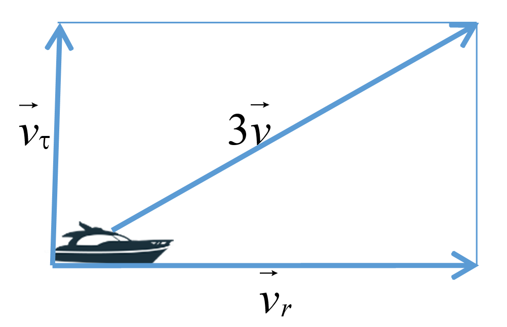{ #fig:005 width=70% }

Из рисунка видно: $v_τ$ = $\sqrt{9v^2-v^2}$= $2v$ $\sqrt{2}$

Тогда получаем: $r$ $\frac {dϴ}{dt}$ = $2v$ $\sqrt{2}$.

6. Решение исходной задачи сводится к решению системы из двух дифференциальных уравнений

$$
\left\{ 
\begin{array}{c}
\frac {dr}{dt}=v \\
r \frac {dϴ}{dt}=2v \sqrt{2} 
\end{array}
\right.
$$

с начальными условиями

$$
\left\{ 
\begin{array}{c}
ϴ_0 = 0 \\
r_0 = x_1  
\end{array}
\right.
$$

или

$$
\left\{ 
\begin{array}{c}
ϴ_0 = -π \\
r_0 = x_2
\end{array}
\right.
$$

Исключая из полученной системы производную по $t$, можно перейти к следующему уравнению:

$\frac {dr}{dϴ}$ = $\frac {r} {2\sqrt{2}}$

Начальные условия остаются прежними. Решив это уравнение, получим траекторию движения катера в полярных координатах.

### Построение траектории движения катера и лодки для двух случаев

#### Задача

Построение траектории движения катера и лодки для двух случаев 

#### Решение

Зададим начальные значения (такое же n (скорость катера больше скорости лодки в 3 раза)), как и в предыдущем пункте, но также зададим $k=5$):

$$
\left\{ 
\begin{array}{c}
k = 5 \\
n = 3 \\
\end{array}
\right.
$$

Отсюда получаем, что $x_1$ = $\frac {5}{4}$, $x_2$ = $\frac {5}{2}$

Также, из этого получим начальные условия для 1 и 2 случая:

Для 1 случая:

$$
\left\{ 
\begin{array}{c}
ϴ_0 = 0 \\
r_0 = \frac {5}{4}
\end{array}
\right.
$$

Для 2 случая:

$$
\left\{ 
\begin{array}{c}
ϴ_0 = -π \\
r_0 = \frac {5}{2}
\end{array}
\right.
$$

Напишем код для данной задачи:

Для 1 случая (рис. [-@fig:007])

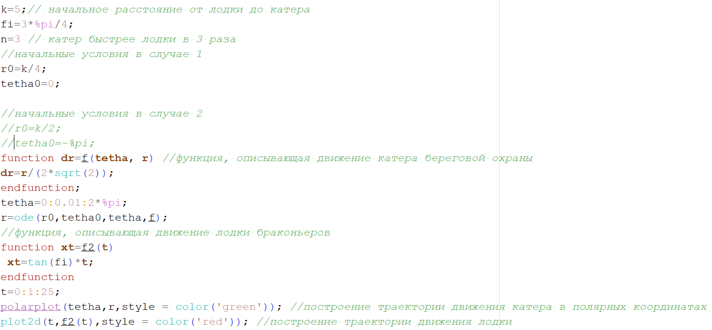{ #fig:007 width=70% }

Также определим траектории катера (зелёный цвет) и лодки (красный цвет) (рис. [-@fig:008])

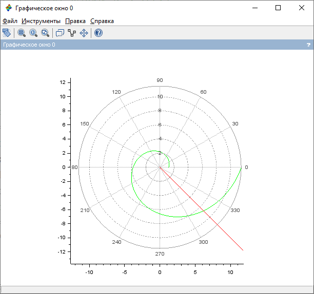{ #fig:008 width=70% }

И точку пересечения катера и лодки (рис. [-@fig:009])

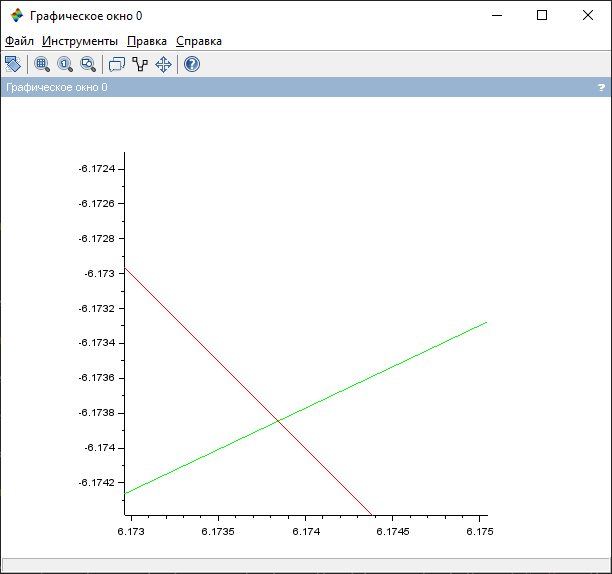{ #fig:009 width=70% }

Из рисунка видно, что точка пересечения $(6.1738;-6.1739)$

Для 2 случая (рис. [-@fig:010])

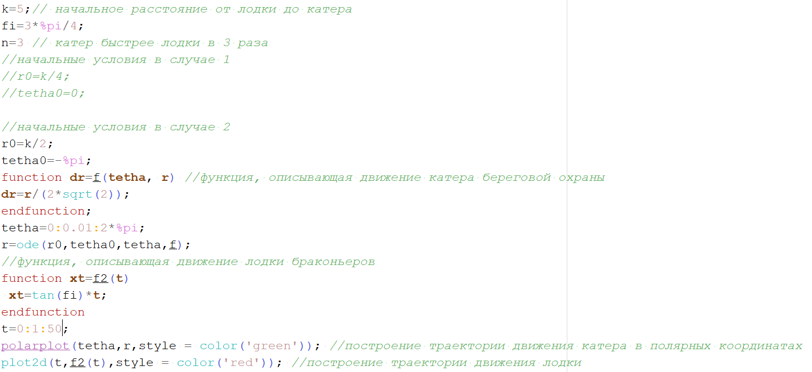{ #fig:010 width=70% }

Также определим траектории катера (зелёный цвет) и лодки (красный цвет) (рис. [-@fig:011])

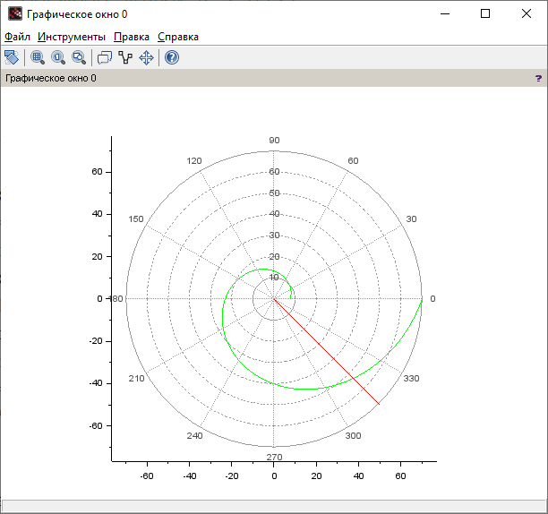{ #fig:011 width=70% }

### Нахождение точки пересечения траектории катера и лодки

Определим точку пересечения катера и лодки (рис. [-@fig:012])

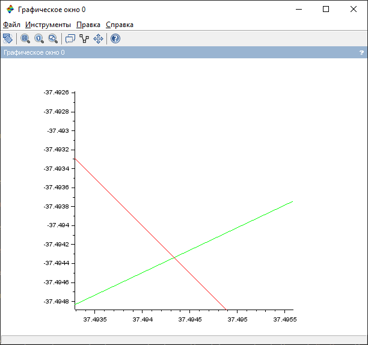{ #fig:012 width=70% }

Из рисунка видно, что точка пересечения $(37.4943;-37.4943)$

## Вариант 38

На море в тумане катер береговой охраны преследует лодку браконьеров. Через определенный промежуток времени туман рассеивается, и лодка обнаруживается на расстоянии 19 км от катера. Затем лодка снова скрывается в тумане и уходит прямолинейно в неизвестном направлении. Известно, что скорость катера в 5,1 раза больше скорости браконьерской лодки.

### Задача 

1. Запишите уравнение, описывающее движение катера, с начальными условиями для двух случаев (в зависимости от расположения катера относительно лодки в начальный момент времени).
2. Постройте траекторию движения катера и лодки для двух случаев.
3. Найдите точку пересечения траектории катера и лодки.

### Решение

#### Записать уравнение, описывающее движение катера, с начальными условиями для двух случаев

1. Принимаем за $t_0 = 0$, $x_{lod0} = 0$ - место нахождения лодки браконьеров в  момент обнаружения, $x_{k0} = 0$ - место нахождения катера береговой охраны относительно лодки браконьеров в момент обнаружения лодки

2. Введем полярные координаты. Считаем, что полюс - это точка обнаружения
лодки браконьеров $x_{lod0} = ϴ = 0$, а полярная ось $r$ проходит через точку нахождения катера береговой охраны

3. Траектория катера должна быть такой, чтобы и катер, и лодка все время были на одном расстоянии от полюса $r$, только в этом случае траектория катера пересечется с траекторией лодки.
Поэтому для начала катер береговой охраны должен двигаться некоторое время прямолинейно, пока не окажется на том же расстоянии от полюса, что и лодка браконьеров. После этого катер береговой охраны должен двигаться вокруг полюса удаляясь от него с той же скоростью, что и лодка браконьеров.

4. Чтобы найти расстояние $x$ (расстояние после которого катер начнет двигаться вокруг полюса), необходимо составить простое уравнение. Пусть через время $t$ катер и лодка окажутся на одном расстоянии $x$ от полюса. За это время лодка пройдет $x$, а катер $19-x$ (или $19+x$, в зависимости от начального положения катера относительно полюса). Время, за которое они пройдут это расстояние, вычисляется как $x/v$ или $(19-x)/5,1v$ (во втором случае $(19+x)/5,1v$). Так как время одно и то же, то эти величины одинаковы. Тогда неизвестное расстояние x можно найти из следующего уравнения:

$\frac {x}{v}$=$\frac {19-x}{5,1v}$ в первом случае

или

$\frac {x}{v}$=$\frac {19+x}{5,1v}$ во втором случае

Отсюда мы найдем два значения: $x_1$ = $\frac {19}{6,1}$, $x_2$ = $\frac {19}{4,1}$

Задачу будем решать для двух случаев.

5. После того, как катер береговой охраны окажется на одном расстоянии от полюса, что и лодка, он должен сменить прямолинейную траекторию и начать двигаться вокруг полюса удаляясь от него со скоростью лодки $v$. Для этого скорость катера раскладываем на две составляющие: $v_r$ -
радиальная скорость и $v_τ$ - тангенциальная скорость. Радиальная
скорость - это скорость, с которой катер удаляется от полюса, $v_r$ = $\frac {dr}{dt}$. Нам
нужно, чтобы эта скорость была равна скорости лодки, поэтому полагаем $\frac {dr}{dt}$ = $v$.
Тангенциальная скорость – это линейная скорость вращения катера относительно полюса. Она равна произведению угловой скорости $\frac {dϴ}{dt}$ радиус $r$, $v_τ$ = r $\frac {dϴ}{dt}$. (рис. [-@fig:006])

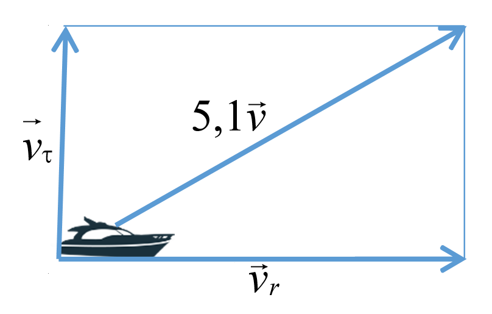{ #fig:006 width=70% }

Из рисунка видно: $v_τ$ = $\sqrt{26.01v^2-v^2}$= $v$ $\sqrt{25.01}$

Тогда получаем: $r$ $\frac {dϴ}{dt}$ = $v$ $\sqrt{25.01}$.

6. Решение исходной задачи сводится к решению системы из двух дифференциальных уравнений

$$
\left\{ 
\begin{array}{c}
\frac {dr}{dt}=v \\
r \frac {dϴ}{dt}=v \sqrt{25.01}
\end{array}
\right.
$$

с начальными условиями

$$
\left\{ 
\begin{array}{c}
ϴ_0 = 0 \\
r_0 = \frac {19}{6,1} 
\end{array}
\right.
$$

или

$$
\left\{ 
\begin{array}{c}
ϴ_0 = -π \\
r_0 = \frac {19}{4,1}
\end{array}
\right.
$$

Исключая из полученной системы производную по t, можно перейти к следующему уравнению:

$\frac {dr}{dϴ}$ = $\frac {r} {\sqrt{25.01}}$

Начальные условия остаются прежними. Решив это уравнение, получим траекторию движения катера в полярных координатах.

### Построение траектории движения катера и лодки для двух случаев

Зададим начальные значения из варианта:

$$
\left\{ 
\begin{array}{c}
k = 19 \\
n = 5.1 \\
\end{array}
\right.
$$

Отсюда получаем, что $x_1$ = $\frac {5}{4}$, $x_2$ = $\frac {5}{2}$

Начальные условия для 1 и 2 случая:

Для 1 случая:

$$
\left\{ 
\begin{array}{c}
ϴ_0 = 0 \\
r_0 = \frac {19}{6,1} 
\end{array}
\right.
$$

Для 2 случая:

$$
\left\{ 
\begin{array}{c}
ϴ_0 = -π \\
r_0 = \frac {19}{4,1}
\end{array}
\right.
$$

Напишем код для данной задачи:

Для 1 случая (рис. [-@fig:013])

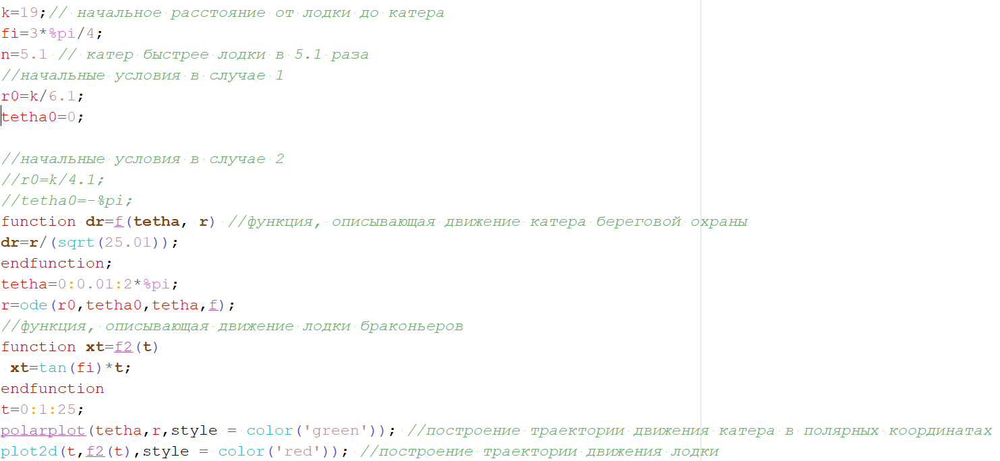{ #fig:013 width=70% }

Также определим траектории катера (зелёный цвет) и лодки (красный цвет) (рис. [-@fig:014])

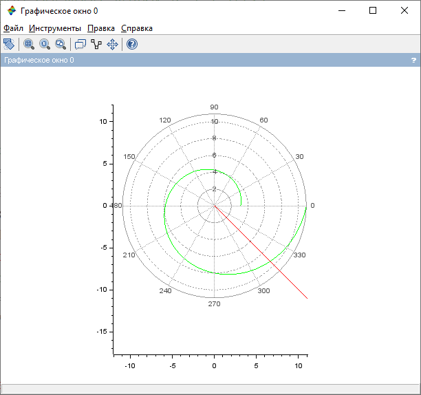{ #fig:014 width=70% }

И точку пересечения катера и лодки (рис. [-@fig:015])

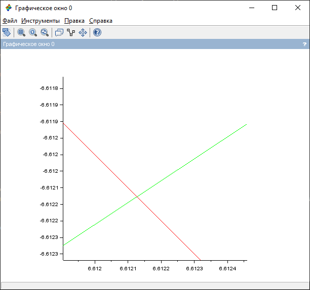{ #fig:015 width=70% }

Из рисунка видно, что точка пересечения $(6.6121;-6.6122)$

Для 2 случая (рис. [-@fig:016])

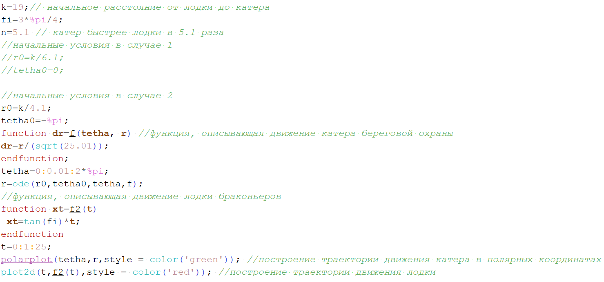{ #fig:016 width=70% }

Также определим траектории катера (зелёный цвет) и лодки (красный цвет) (рис. [-@fig:017])

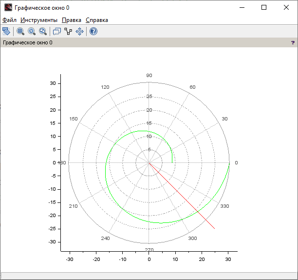{ #fig:017 width=70% }

### Нахождение точки пересечения траектории катера и лодки

И точку пересечения катера и лодки (рис. [-@fig:018])

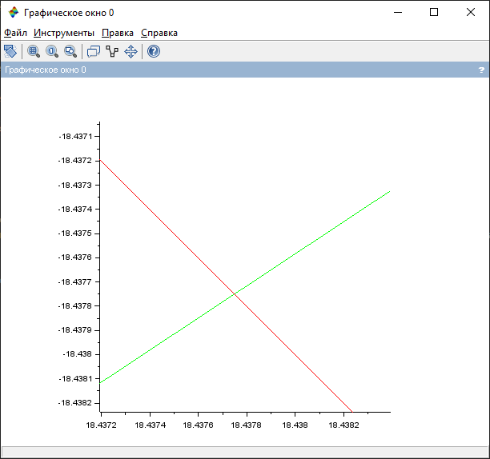{ #fig:018 width=70% }

Из рисунка видно, что точка пересечения $(18.4378;-18.4378)$

# Выводы

В ходе данной лабораторной работы я рассмотрел пример построения математических моделей для выбора правильной стратегии при решении задач поиска. С помощью примера научился решать задачи такого типа.

# Библиография

1. Scilab documentation. [Электронный ресурс]. М. URL: [Scilab documentation](https://wiki.scilab.org/Documentation) (Дата обращения: 17.02.2021).

2. Лабораторная работа №2. Задача о погоне. - 4 с. [Электронный ресурс]. М. URL: [Лабораторная работа №2](https://stud-sci.rudn.ru/pluginfile.php/16876/mod_folder/content/0/project01.pdf) (Дата обращения: 17.02.2021).

3. Лабораторная работа №2. Варианты. [Электронный ресурс]. М. URL: [Варианты](https://esystem.rudn.ru/pluginfile.php/1343882/mod_resource/content/2/Задание%20к%20лабораторной%20работе%20№%205%20%281%29.pdf) (Дата обращения: 17.02.2021).