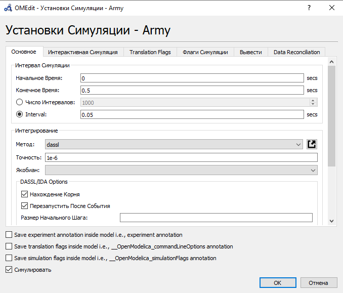

---
## Front matter
lang: ru-RU
title: Лабораторная работа №3. Модель боевых действий.
author: |
	Alexander S. Baklashov
institute: |
	RUDN University, Moscow, Russian Federation

date: 25 February, 2022

## Formatting
toc: false
slide_level: 2
theme: metropolis
header-includes: 
 - \metroset{progressbar=frametitle,sectionpage=progressbar,numbering=fraction}
 - '\makeatletter'
 - '\beamer@ignorenonframefalse'
 - '\makeatother'
aspectratio: 43
section-titles: true
---

# Цель работы

Рассмотреть простейшие модели боевых действий – модели Ланчестера. С помощью рассмотренного примера научиться решать задачи такого типа.

# Задачи

1. Постройте графики изменения численности войск армии $X$ и армии $Y$ для
следующих случаев:

 - Модель боевых действий между регулярными войсками

 - Модель ведения боевых действий с участием регулярных войск и партизанских отрядов

2. Определить победителя в каждом из случаев

## Задача

Между страной $X$ и страной $Y$ идет война. Численность состава войск
исчисляется от начала войны, и являются временными функциями $x(t)$ и $y(t)$. В начальный момент времени страна $X$ имеет армию численностью $882 000$ человек, а в распоряжении страны $Y$ армия численностью в $747 000$ человек. Для упрощения модели считаем, что коэффициенты $a$, $b$, $c$, $h$ постоянны. Также считаем, что $P(t)$ и $Q(t)$ - непрерывные функции.

Постройте графики изменения численности войск армии $X$ и армии $Y$ для следующих случаев:

## Задача

1. Модель боевых действий между регулярными войсками

$\frac {dx}{dt}$=$-0,4x(t)-0,67y(t)+sin(3t)+1$

$\frac {dy}{dt}$=$-0,77x(t)-0,14y(t)+cos(2t)+2$

2. Модель ведения боевых действий с участием регулярных войск и
партизанских отрядов

$\frac {dx}{dt}$=$-0,24x(t)-0,67y(t)+|sin(2t)|$

$\frac {dy}{dt}$=$-0,47x(t)y(t)-0,14y(t)+|cos(2t)|$

3. Также мы рассмотрим модель ведения боевых действий между партизанскими отрядами

$\frac {dx}{dt}$=$-0,4x(t)-0,67x(t)y(t)+sin(3t)+1$

$\frac {dy}{dt}$=$-0,77y(t)-0,14x(t)y(t)+cos(2t)+2$

## Код

Напишем код для 3х случаев

{ #fig:001 width=40% }

## Первый случай

Зададим параметры симуляции для 1 случая

{ #fig:002 width=70% }

## Первый случай

Построим график для 1 случая

{ #fig:003 width=80% }

Из рисунка видно, что армия $x$ (красный цвет) выиграла армию $y$ (синий цвет)

## Второй случай

Зададим параметры симуляции для 2 случая

{ #fig:004 width=70% }

## Второй случай

Построим график для 2 случая

{ #fig:005 width=80% }

Из рисунка видно, что армия $x$ (красный цвет) выиграла армию $y$ (синий цвет)

## Третий случай

Зададим параметры симуляции для 3 случая

{ #fig:009 width=70% }

## Третий случай

Построим график для 3 случая

{ #fig:010 width=80% }

Из рисунка видно, что армия  $x$ (синий цвет) выиграла армию $y$ (красный цвет)

## *Четвёртый случай
Код для 4 случая 

{ #fig:011 width=40% }

## *Четвёртый случай

Зададим параметры симуляции для 4 случая 

{ #fig:012 width=70% }

## *Четвёртый случай

Построим график для 4 случая 

{ #fig:013 width=80% }

Из рисунка видно, что армия  $y$ (синий цвет) выиграла армию $x$ (красный цвет)

# Выводы

В ходе данной лабораторной работы я рассмотрел простейшие модели боевых действий – модели Ланчестера. С помощью рассмотренного примера научился решать задачи такого типа.