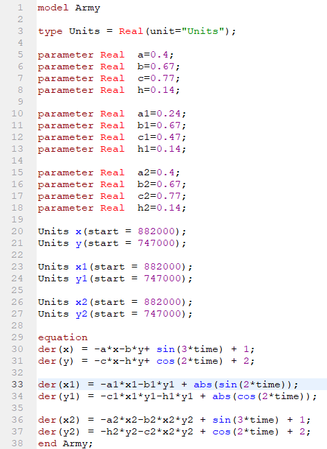
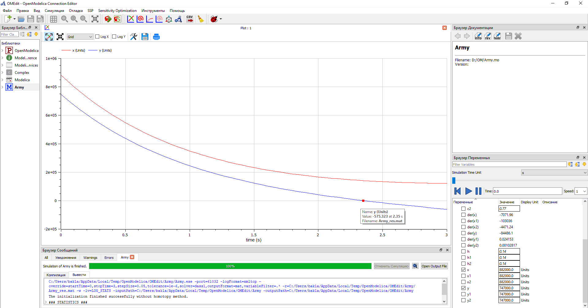
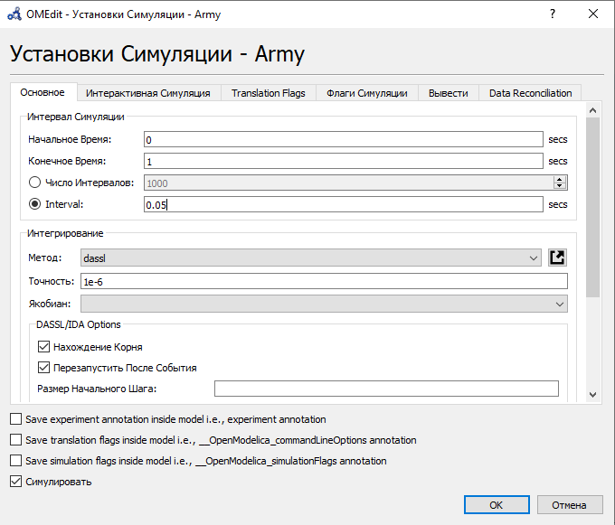
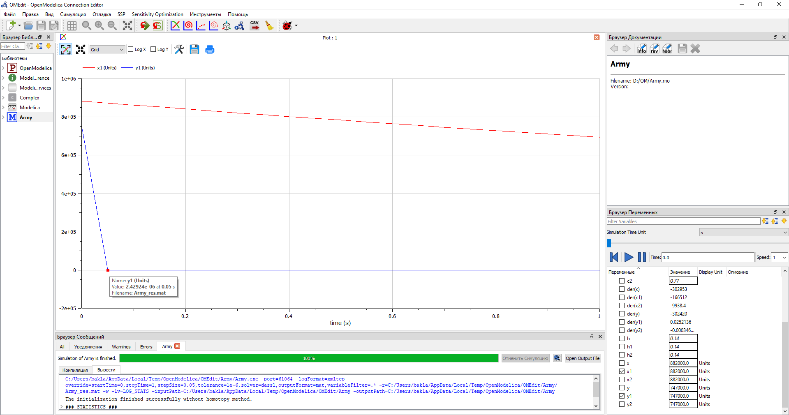
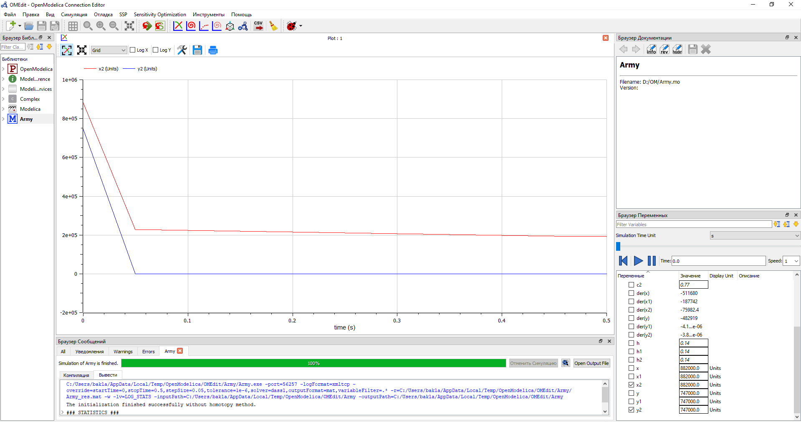
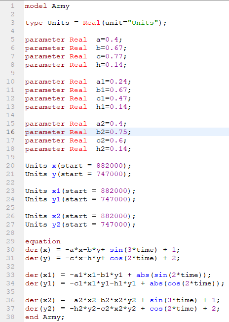
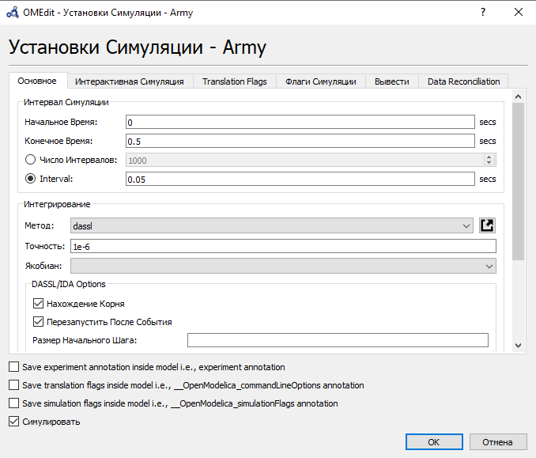
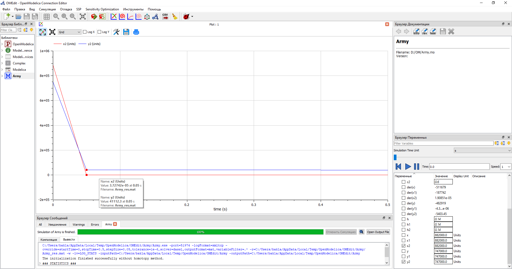

---
# Front matter
title: "Отчёт по лабораторной работе №3. Модель боевых действий."
subtitle: "Предмет: математическое моделирование"
author: "Александр Сергеевич Баклашов"

# Generic otions
lang: ru-RU
toc-title: "Содержание"

# Bibliography
bibliography: bib/cite.bib
csl: pandoc/csl/gost-r-7-0-5-2008-numeric.csl

# References settings
linkReferences: true
nameInLink: true

# Pdf output format
toc: true # Table of contents
toc_depth: 2
lof: true # List of figures
lot: false # List of tables
fontsize: 12pt
linestretch: 1.5
papersize: a4
documentclass: scrreprt
## I18n
polyglossia-lang:
  name: russian
  options:
	- spelling=modern
	- babelshorthands=true
polyglossia-otherlangs:
  name: english
### Fonts
mainfont: PT Serif
romanfont: PT Serif
sansfont: PT Sans
monofont: PT Mono
mainfontoptions: Ligatures=TeX
romanfontoptions: Ligatures=TeX
sansfontoptions: Ligatures=TeX,Scale=MatchLowercase
monofontoptions: Scale=MatchLowercase,Scale=0.9
## Biblatex
biblatex: true
biblio-style: "gost-numeric"
biblatexoptions:
  - parentracker=true
  - backend=biber
  - hyperref=auto
  - language=auto
  - autolang=other*
  - citestyle=gost-numeric
## Misc options
indent: true
header-includes:
  - \linepenalty=10 # the penalty added to the badness of each line within a paragraph (no associated penalty node) Increasing the value makes tex try to have fewer lines in the paragraph.
  - \interlinepenalty=0 # value of the penalty (node) added after each line of a paragraph.
  - \hyphenpenalty=50 # the penalty for line breaking at an automatically inserted hyphen
  - \exhyphenpenalty=50 # the penalty for line breaking at an explicit hyphen
  - \binoppenalty=700 # the penalty for breaking a line at a binary operator
  - \relpenalty=500 # the penalty for breaking a line at a relation
  - \clubpenalty=150 # extra penalty for breaking after first line of a paragraph
  - \widowpenalty=150 # extra penalty for breaking before last line of a paragraph
  - \displaywidowpenalty=50 # extra penalty for breaking before last line before a display math
  - \brokenpenalty=100 # extra penalty for page breaking after a hyphenated line
  - \predisplaypenalty=10000 # penalty for breaking before a display
  - \postdisplaypenalty=0 # penalty for breaking after a display
  - \floatingpenalty = 20000 # penalty for splitting an insertion (can only be split footnote in standard LaTeX)
  - \raggedbottom # or \flushbottom
  - \usepackage{float} # keep figures where there are in the text
  - \floatplacement{figure}{H} # keep figures where there are in the text
---

# Цель работы

Рассмотреть простейшие модели боевых действий – модели Ланчестера. С помощью рассмотренного примера научиться решать задачи такого типа.

# Задание

1. Постройте графики изменения численности войск армии $X$ и армии $Y$ для
следующих случаев:

 - Модель боевых действий между регулярными войсками

 - Модель ведения боевых действий с участием регулярных войск и партизанских отрядов

2. Определить победителя в каждом из случаев

# Теоретическое введение

Рассмотрим три случая ведения боевых действий:
1. Боевые действия между регулярными войсками
2. Боевые действия с участием регулярных войск и партизанских
отрядов
3. Боевые действия между партизанскими отрядами

В первом случае численность регулярных войск определяется тремя факторами:

- скорость уменьшения численности войск из-за причин, не связанных с
боевыми действиями (болезни, травмы, дезертирство);
- скорость потерь, обусловленных боевыми действиями противоборствующих сторон (что связанно с качеством стратегии, уровнем вооружения, профессионализмом солдат и т.п.);
- скорость поступления подкрепления (задаётся некоторой функцией от времени).

В этом случае модель боевых действий между регулярными войсками описывается следующим образом:

$\frac {dx}{dt}$=$-a(t)x(t)-b(t)y(t)+P(t)$

$\frac {dy}{dt}$=$-c(t)x(t)-h(t)y(t)+Q(t)$

Потери, не связанные с боевыми действиями, описывают члены $-a(t)x(t)$ и $-h(t)y(t)$, члены $-b(t)y(t)$ и $-c(t)x(t)$ отражают потери на поле боя. Коэффициенты $b(t)$ и $c(t)$ указывают на эффективность боевых действий со стороны $y$ и $x$ соответственно, $a(t)$, $h(t)$ - величины, характеризующие степень влияния различных факторов на потери. Функции $P(t)$, $Q(t)$ учитывают 
возможность подхода подкрепления к войскам $X$ и $Y$ в течение одного дня. 

Во втором случае в борьбу добавляются партизанские отряды. Нерегулярные войска в отличии от постоянной армии менее уязвимы, так как действуют скрытно, в этом случае сопернику приходится действовать неизбирательно, по площадям, занимаемым партизанами. Поэтому считается, что темп потерь партизан, проводящих свои операции в разных местах на некоторой известной территории,
пропорционален не только численности армейских соединений, но и численности
самих партизан. В результате модель принимает вид:

$\frac {dx}{dt}$=$-a(t)x(t)-b(t)y(t)+P(t)$

$\frac {dy}{dt}$=$-c(t)x(t)y(t)-h(t)y(t)+Q(t)$

В этой системе все величины имеют тот же смысл, что и в системе в 1 случае.

Модель ведение боевых действий между партизанскими отрядами с учетом
предположений, сделанных в предыдущем случае, имеет вид:

$\frac {dx}{dt}$=$-a(t)x(t)-b(t)x(t)y(t)+P(t)$

$\frac {dy}{dt}$=$-h(t)y(t)-c(t)x(t)y(t)+Q(t)$

# Выполнение лабораторной работы

## Задача (Вариант 38)

Между страной $X$ и страной $Y$ идет война. Численность состава войск
исчисляется от начала войны, и являются временными функциями $x(t)$ и $y(t)$. В начальный момент времени страна $X$ имеет армию численностью $882 000$ человек, а в распоряжении страны $Y$ армия численностью в $747 000$ человек. Для упрощения модели считаем, что коэффициенты $a$, $b$, $c$, $h$ постоянны. Также считаем, что $P(t)$ и $Q(t)$ - непрерывные функции.

Постройте графики изменения численности войск армии $X$ и армии $Y$ для
следующих случаев:

1. Модель боевых действий между регулярными войсками

$\frac {dx}{dt}$=$-0,4x(t)-0,67y(t)+sin(3t)+1$

$\frac {dy}{dt}$=$-0,77x(t)-0,14y(t)+cos(2t)+2$

2. Модель ведения боевых действий с участием регулярных войск и
партизанских отрядов

$\frac {dx}{dt}$=$-0,24x(t)-0,67y(t)+|sin(2t)|$

$\frac {dy}{dt}$=$-0,47x(t)y(t)-0,14y(t)+|cos(2t)|$

3. Также мы рассмотрим модель ведения боевых действий между партизанскими отрядами

$\frac {dx}{dt}$=$-0,4x(t)-0,67x(t)y(t)+sin(3t)+1$

$\frac {dy}{dt}$=$-0,77y(t)-0,14x(t)y(t)+cos(2t)+2$

## Решение

### Код

1. Напишем в программе OpenModelica код для 3х случаев (рис. [-@fig:001])

{ #fig:001 width=80% }

### Первый случай

1. Зададим параметры симуляции для 1 случая (рис. [-@fig:002])

{ #fig:002 width=90% }

2. Построим график для 1 случая (рис. [-@fig:003])

{ #fig:003 width=90% }

Из рисунка видно, что армия $x$ (красный цвет) выиграла армию $y$ (синий цвет)

### Второй случай

1. Зададим параметры симуляции для 2 случая (рис. [-@fig:004])

{ #fig:004 width=90% }

2. Построим график для 2 случая (рис. [-@fig:005])

{ #fig:005 width=90% }

Из рисунка видно, что армия $x$ (красный цвет) выиграла армию $y$ (синий цвет)

### Третий случай

1. Зададим параметры симуляции для 3 случая (рис. [-@fig:009])

{ #fig:009 width=70% }

2. Построим график для 3 случая (рис. [-@fig:010])

{ #fig:010 width=90% }

Из рисунка видно, что армия  $x$ (синий цвет) выиграла армию $y$ (красный цвет)

### *Четвёртый случай
1. Напишем код для 4 случая (рис. [-@fig:011])

{ #fig:011 width=70% }

1. Зададим параметры симуляции для 4 случая (рис. [-@fig:012])

{ #fig:012 width=70% }

2. Построим график для 4 случая (рис. [-@fig:013])

{ #fig:013 width=90% }

Из рисунка видно, что армия  $y$ (синий цвет) выиграла армию $x$ (красный цвет)

# Выводы

В ходе данной лабораторной работы я рассмотрел простейшие модели боевых действий – модели Ланчестера. С помощью рассмотренного примера научился решать задачи такого типа.

# Библиография

1. Modelica: Language Specification. - 308 с. [Электронный ресурс]. М. URL: [Language Specification](https://modelica.org/documents/ModelicaSpec34.pdf) (Дата обращения: 25.02.2021).

2. Лабораторная работа №3. Задача о погоне. - 7 с. [Электронный ресурс]. М. URL: [Лабораторная работа №3](https://stud-sci.rudn.ru/pluginfile.php/16876/mod_folder/content/0/project02.pdf) (Дата обращения: 25.02.2021).

3. Лабораторная работа №3. Варианты. [Электронный ресурс]. М. URL: [Варианты](https://esystem.rudn.ru/pluginfile.php/1343886/mod_resource/content/2/Лабораторная%20работа%20№%204.pdf) (Дата обращения: 25.02.2021).