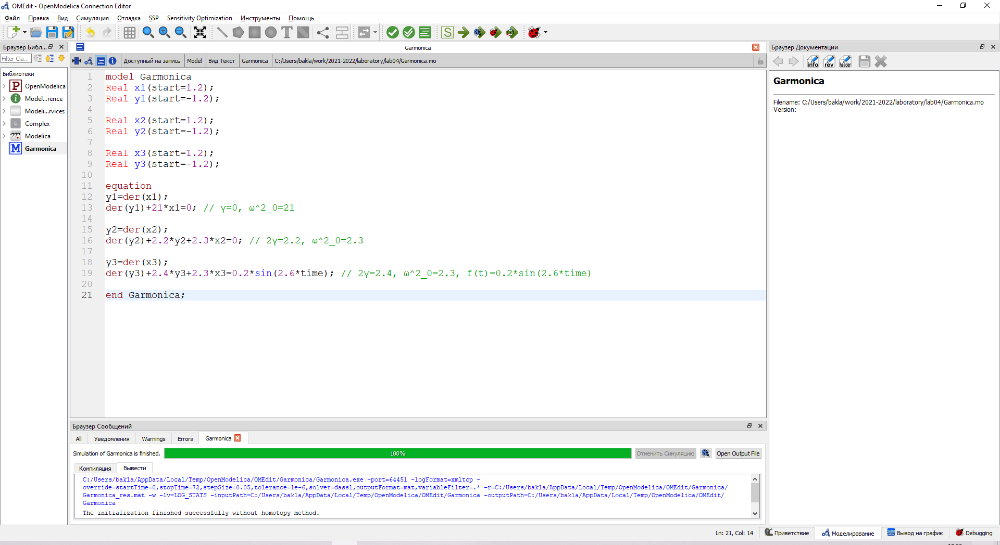
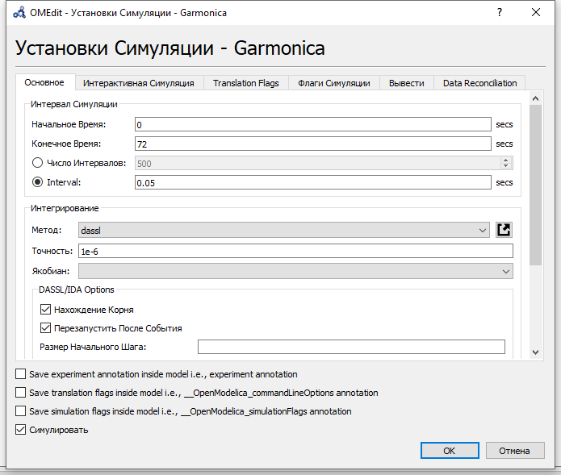
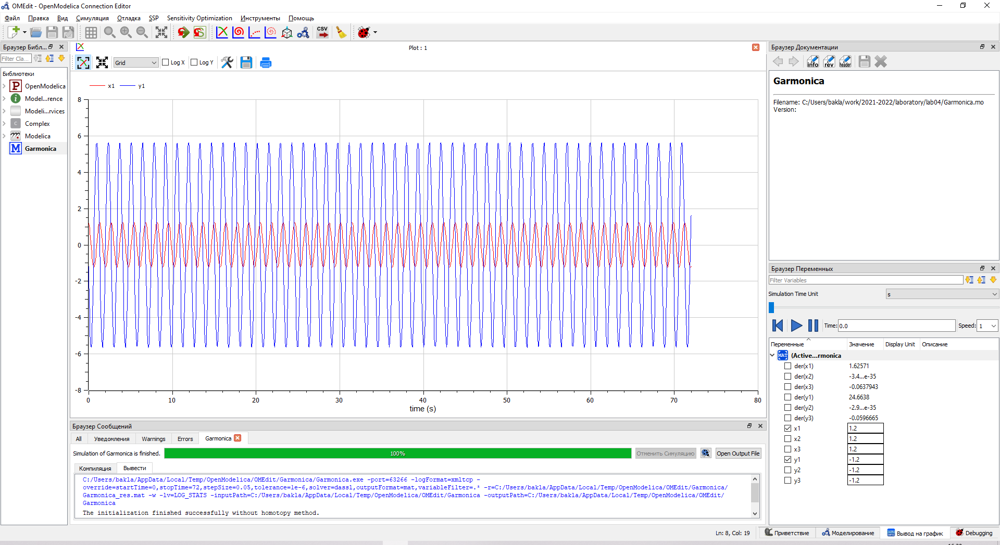
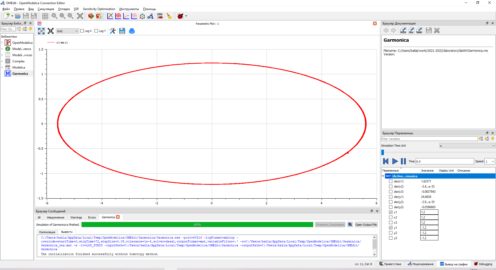
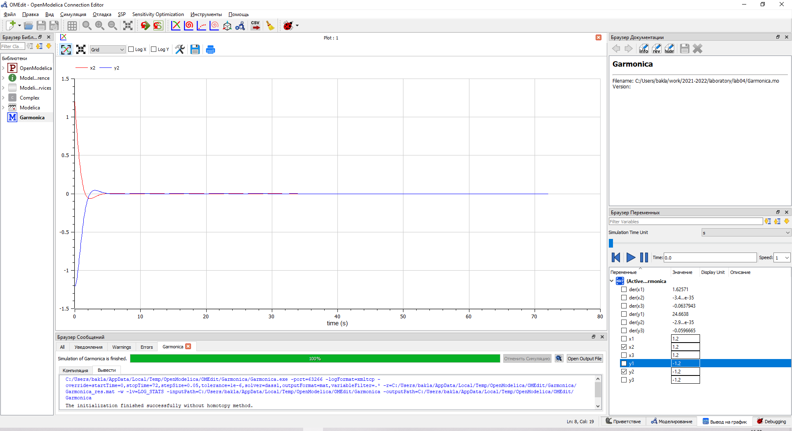
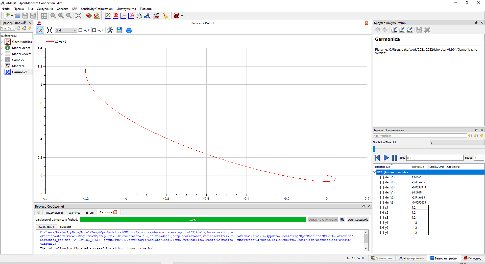
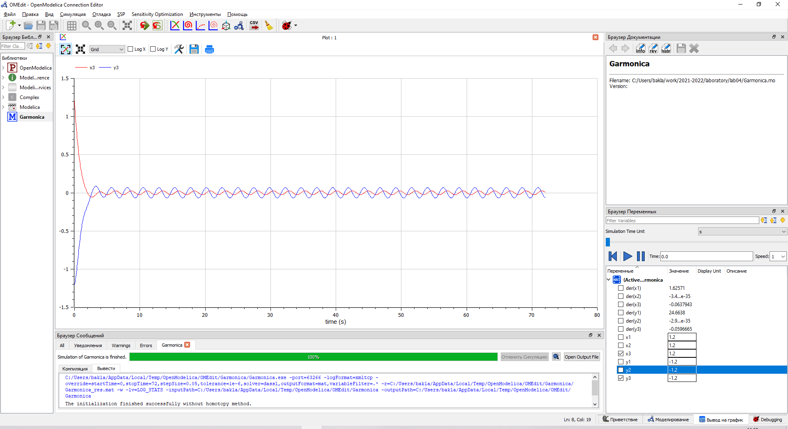
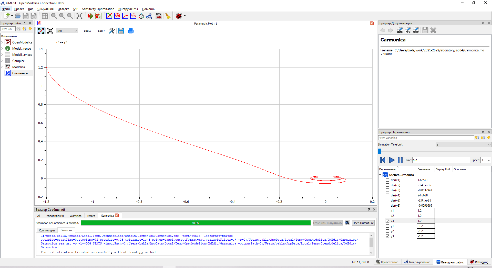

---
## Front matter
lang: ru-RU
title: Лабораторная работа №4. Модель гармонических колебаний.
author: |
	Alexander S. Baklashov
institute: |
	RUDN University, Moscow, Russian Federation

date: 03 March, 2022

## Formatting
toc: false
slide_level: 2
theme: metropolis
header-includes: 
 - \metroset{progressbar=frametitle,sectionpage=progressbar,numbering=fraction}
 - '\makeatletter'
 - '\beamer@ignorenonframefalse'
 - '\makeatother'
aspectratio: 43
section-titles: true
---

# Цель работы

Рассмотреть модели линейного гармонического осциллятора. С помощью рассмотренного примера научиться решать задачи такого типа для разных случаев.

# Задачи

Постройте фазовый портрет гармонического осциллятора и решение уравнения гармонического осциллятора для следующих случаев:

1. Колебания гармонического осциллятора без затуханий и без действий внешней силы

2. Колебания гармонического осциллятора c затуханием и без действий внешней силы

3. Колебания гармонического осциллятора c затуханием и под действием внешней силы

# Задача (Вариант 38)

## Задача

Постройте фазовый портрет гармонического осциллятора и решение уравнения
гармонического осциллятора для следующих случаев:

## Задача

1. Колебания гармонического осциллятора без затуханий и без действий внешней силы

$\ddot{x}+21x=0$

На интервале $t∈[0;72]$ (шаг $0.05$) с начальными условиями $x_0=1.2$, $y_0=-1.2$

## Задача

2. Колебания гармонического осциллятора c затуханием и без действий внешней силы

$\ddot{x}+2.2\dot{x}+2.3x=0$

На интервале $t∈[0;72]$ (шаг $0.05$) с начальными условиями $x_0=1.2$, $y_0=-1.2$

## Задача

3. Колебания гармонического осциллятора c затуханием и под действием внешней силы

$\ddot{x}+2.4\dot{x}+2.5x=0.2sin(2.6t)$

На интервале $t∈[0;72]$ (шаг $0.05$) с начальными условиями $x_0=1.2$, $y_0=-1.2$

# Выполнение лабораторной работы

## Код

Напишем код для 3х случаев

{ #fig:001 width=100% }

## Параметры симуляции

Зададим параметры симуляции

{ #fig:002 width=70% }

## Первый случай

1. Построим решение уравнения гармонического осциллятора для 1 случая 

{ #fig:003 width=80% }

## Первый случай

2. Построим фазовый портрет для 1 случая 

{ #fig:004 width=80% }

## Второй случай

1. Построим решение уравнения гармонического осциллятора для 2 случая 

{ #fig:005 width=80% }

## Второй случай

2. Построим фазовый портрет для 2 случая 

{ #fig:006 width=80% }

## Третий случай

1. Построим решение уравнения гармонического осциллятора для 3 случая 

{ #fig:007 width=80% }

## Третий случай

2. Построим фазовый портрет для 3 случая 

{ #fig:008 width=80% }

# Выводы

В ходе данной лабораторной работы я рассмотрел модели линейного гармонического осциллятора для 3 случаев и научился решать задачи такого типа.