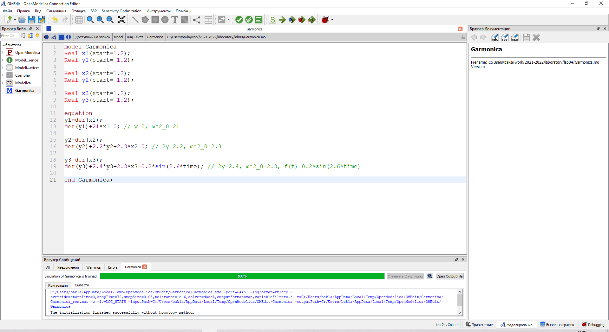
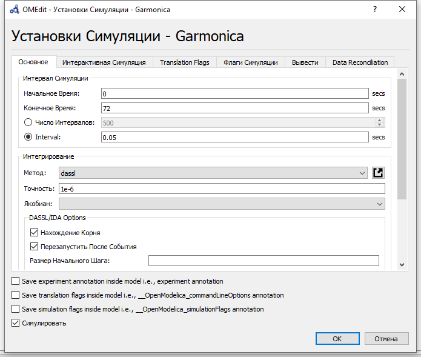
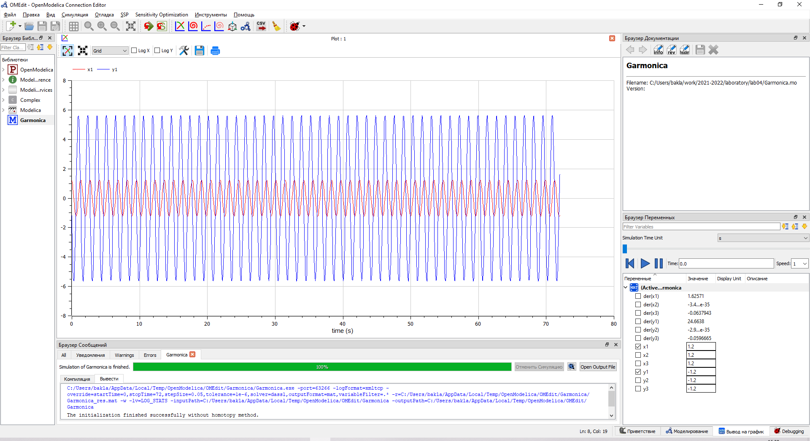
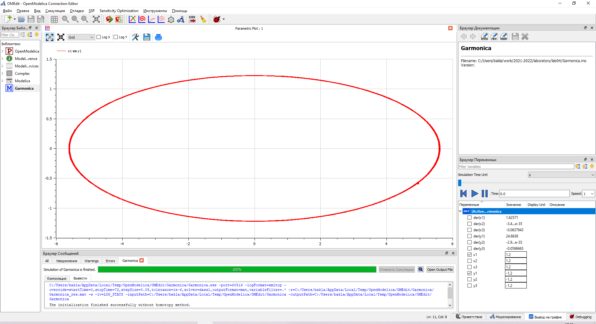
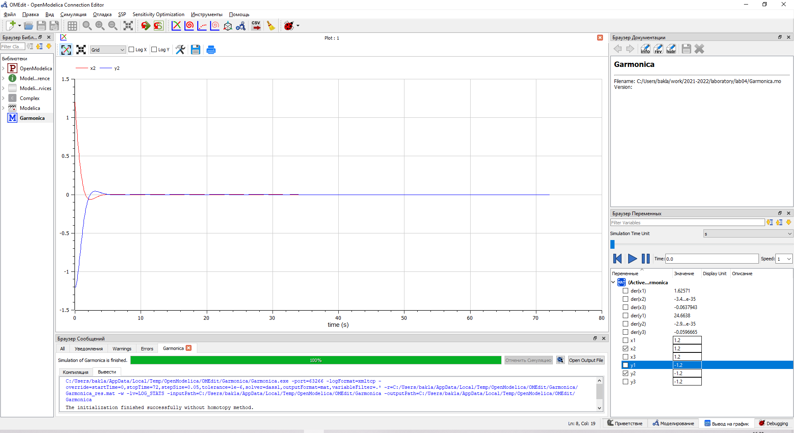
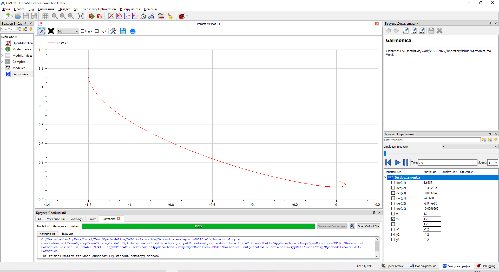
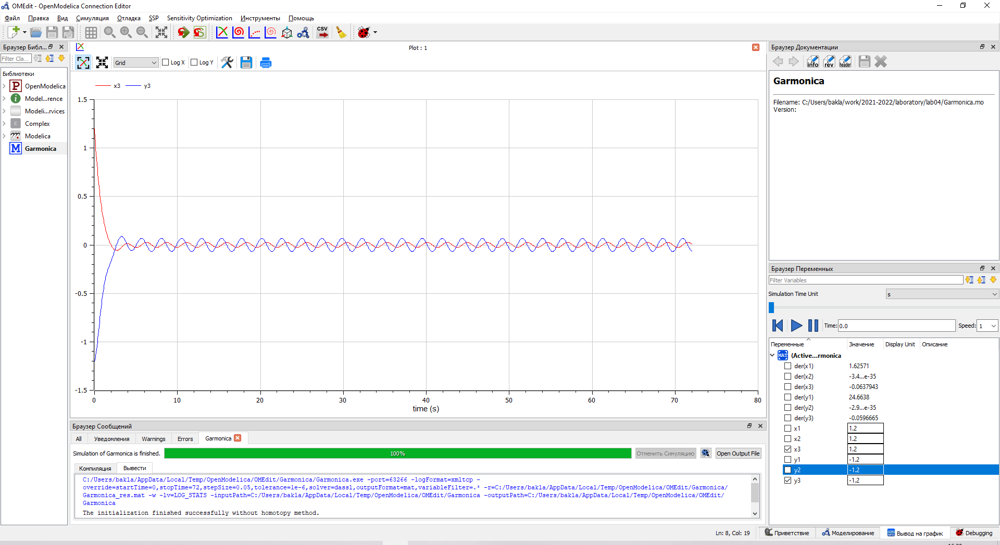
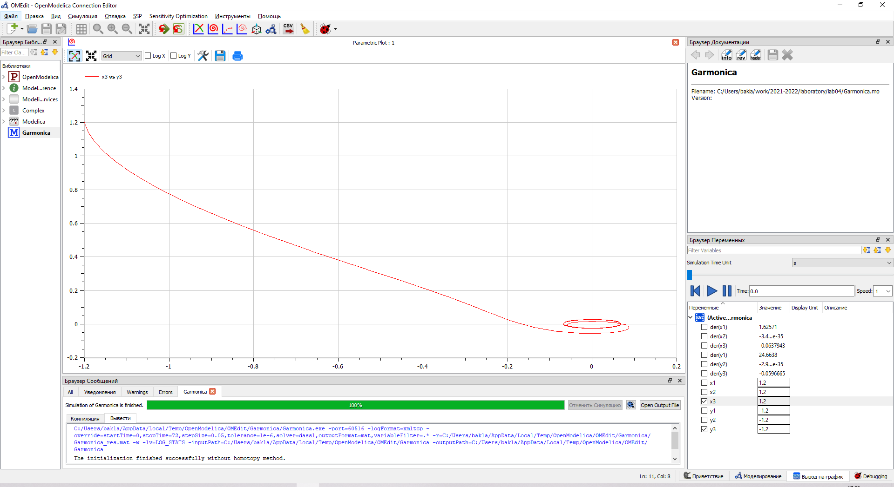

---
# Front matter
title: "Отчёт по лабораторной работе №4. Модель гармонических колебаний."
subtitle: "Предмет: математическое моделирование"
author: "Александр Сергеевич Баклашов"

# Generic otions
lang: ru-RU
toc-title: "Содержание"

# Bibliography
bibliography: bib/cite.bib
csl: pandoc/csl/gost-r-7-0-5-2008-numeric.csl

# References settings
linkReferences: true
nameInLink: true

# Pdf output format
toc: true # Table of contents
toc_depth: 2
lof: true # List of figures
lot: false # List of tables
fontsize: 12pt
linestretch: 1.5
papersize: a4
documentclass: scrreprt
## I18n
polyglossia-lang:
  name: russian
  options:
	- spelling=modern
	- babelshorthands=true
polyglossia-otherlangs:
  name: english
### Fonts
mainfont: PT Serif
romanfont: PT Serif
sansfont: PT Sans
monofont: PT Mono
mainfontoptions: Ligatures=TeX
romanfontoptions: Ligatures=TeX
sansfontoptions: Ligatures=TeX,Scale=MatchLowercase
monofontoptions: Scale=MatchLowercase,Scale=0.9
## Biblatex
biblatex: true
biblio-style: "gost-numeric"
biblatexoptions:
  - parentracker=true
  - backend=biber
  - hyperref=auto
  - language=auto
  - autolang=other*
  - citestyle=gost-numeric
## Misc options
indent: true
header-includes:
  - \linepenalty=10 # the penalty added to the badness of each line within a paragraph (no associated penalty node) Increasing the value makes tex try to have fewer lines in the paragraph.
  - \interlinepenalty=0 # value of the penalty (node) added after each line of a paragraph.
  - \hyphenpenalty=50 # the penalty for line breaking at an automatically inserted hyphen
  - \exhyphenpenalty=50 # the penalty for line breaking at an explicit hyphen
  - \binoppenalty=700 # the penalty for breaking a line at a binary operator
  - \relpenalty=500 # the penalty for breaking a line at a relation
  - \clubpenalty=150 # extra penalty for breaking after first line of a paragraph
  - \widowpenalty=150 # extra penalty for breaking before last line of a paragraph
  - \displaywidowpenalty=50 # extra penalty for breaking before last line before a display math
  - \brokenpenalty=100 # extra penalty for page breaking after a hyphenated line
  - \predisplaypenalty=10000 # penalty for breaking before a display
  - \postdisplaypenalty=0 # penalty for breaking after a display
  - \floatingpenalty = 20000 # penalty for splitting an insertion (can only be split footnote in standard LaTeX)
  - \raggedbottom # or \flushbottom
  - \usepackage{float} # keep figures where there are in the text
  - \floatplacement{figure}{H} # keep figures where there are in the text
---

# Цель работы

Рассмотреть модели линейного гармонического осциллятора. С помощью рассмотренного примера научиться решать задачи такого типа для разных случаев.

# Задание

Постройте фазовый портрет гармонического осциллятора и решение уравнения гармонического осциллятора для следующих случаев:

1. Колебания гармонического осциллятора без затуханий и без действий внешней силы

2. Колебания гармонического осциллятора c затуханием и без действий внешней силы

3. Колебания гармонического осциллятора c затуханием и под действием внешней силы

# Теоретическое введение

Движение грузика на пружинке, маятника, заряда в электрическом контуре, а также эволюция во времени многих систем в физике, химии, биологии и других науках при определенных предположениях можно описать одним и тем же дифференциальным уравнением, которое в теории колебаний выступает в качестве основной модели. Эта модель называется линейным гармоническим осциллятором.
Уравнение свободных колебаний гармонического осциллятора имеет следующий вид:

$$\ddot{x}+2γ\dot{x}+ω^2_0=0$$ 

где $x$ – переменная, описывающая состояние системы (смещение грузика, заряд конденсатора и т.д.), $γ$ – параметр, характеризующий потери энергии (трение в механической системе, сопротивление в контуре), $ω_0$ – собственная частота колебаний, $t$ – время.

Данное уравнение есть линейное однородное дифференциальное уравнение второго порядка и оно является примером линейной динамической системы. При отсутствии потерь в системе $(γ=0)$ вместо этого уравнения получаем уравнение консервативного осциллятора, энергия колебания которого сохраняется во времени.

$$\ddot{x}+ω^2_0=0$$ 

Для однозначной разрешимости данного уравнения второго порядка необходимо задать два начальных условия вида
$$
\left\{ 
\begin{array}{c}
x(t_0)=x_0 \\
\dot{x} (t_0)=y_0
\end{array}
\right.
$$
Уравнение второго порядка можно представить в виде системы двух уравнений первого порядка:
$$
\left\{ 
\begin{array}{c}
\dot{x}=y \\
\dot{y}=-ω^2_0x \\
\end{array}
\right.
$$
Начальные условия для такой системы примут вид:
$$
\left\{ 
\begin{array}{c}
x(t_0)=x_0 \\
y(t_0)=y_0
\end{array}
\right.
$$
Независимые переменные $x$, $y$ определяют пространство, в котором «движется» решение. Это фазовое пространство системы, поскольку оно двумерно будем называть его фазовой плоскостью.

Значение фазовых координат $x$, $y$ в любой момент времени полностью определяет состояние системы. Решению уравнения движения как функции времени отвечает гладкая кривая в фазовой плоскости. Она называется фазовой траекторией. Если множество различных решений (соответствующих различным начальным условиям) изобразить на одной фазовой плоскости, возникает общая картина поведения системы. Такую картину, образованную набором фазовых траекторий, называют фазовым портретом. [2]

# Выполнение лабораторной работы

## Задача (Вариант 38)

Постройте фазовый портрет гармонического осциллятора и решение уравнения
гармонического осциллятора для следующих случаев:

1. Колебания гармонического осциллятора без затуханий и без действий внешней силы

$\ddot{x}+21x=0$

2. Колебания гармонического осциллятора c затуханием и без действий внешней силы

$\ddot{x}+2.2\dot{x}+2.3x=0$

3. Колебания гармонического осциллятора c затуханием и под действием внешней силы

$\ddot{x}+2.4\dot{x}+2.5x=0.2sin(2.6t)$

На интервале $t∈[0;72]$ (шаг $0.05$) с начальными условиями $x_0=1.2$, $y_0=-1.2$ [3]

## Решение

### Код

Напишем код для 3х случаев в OpenModelica[1] (рис. [-@fig:001])

{ #fig:001 width=90% }

### Параметры симуляции

Зададим параметры симуляции (рис. [-@fig:002])

{ #fig:002 width=90% }

### Первый случай

1. Построим решение уравнения гармонического осциллятора для 1 случая (рис. [-@fig:003])

{ #fig:003 width=90% }

2. Построим фазовый портрет для 1 случая (рис. [-@fig:004])

{ #fig:004 width=90% }

### Второй случай

1. Построим решение уравнения гармонического осциллятора для 2 случая (рис. [-@fig:005])

{ #fig:005 width=90% }

2. Построим фазовый портрет для 2 случая (рис. [-@fig:006])

{ #fig:006 width=90% }

### Третий случай

1. Построим решение уравнения гармонического осциллятора для 3 случая (рис. [-@fig:007])

{ #fig:007 width=90% }

2. Построим фазовый портрет для 3 случая (рис. [-@fig:008])

{ #fig:008 width=90% }

# Выводы

В ходе данной лабораторной работы я рассмотрел модели линейного гармонического осциллятора для 3 случаев и научился решать задачи такого типа.

# Вопросы к лабораторной работе

1. Запишите простейшую модель гармонических колебаний

Уравнение гармонических колебаний:
$$x=Acos(ω_0t+ϕ)$$
где $x$ - смещение колеблющейся точки от положения равновесия;

$t$ - время;

$A$ - соответственно амплитуда;

$ω_0$ - угловая частота,

$ϕ$ - начальная фаза колебаний;

$(ω_0t +ϕ)$ - фаза колебаний в момент $t$. 

2. Дайте определение осциллятора

Осциллятор — система, совершающая колебания. Показатели такой системы переодически повторяются во времени.

3. Запишите модель математического маятника

$$\ddot{x}+ω^2_0=0$$ 

4. Запишите алгоритм перехода от дифференциального уравнения второго порядка к двум дифференциальным уравнениям первого порядка

Переменную, от которой берется производная 2 порядка, заменяем на ту же переменную, но от которой берется производная 1 порядка. Далее записываем её как другую переменную $-$ первое уравнение системы. Далее берём производную от неё и смотрим на исходное уравнение $-$ второе уравнение системы. Например:

$$\ddot{x}+5x=0$$ 

Переменную, от которой берется производная 2 порядка($\ddot{x}$), заменяем на ту же переменную, но от которой берется производная 1 порядка ($\dot{x}$). Далее записываем её как другую переменную($y$):

$y=\dot{x}$ $-$ первое уравнение системы.

Далее берём производную от неё ($\dot{y}$=$\ddot{x}$) и смотрим на исходное уравнение:

$\dot{y}=-5x$ $-$ второе уравнение системы.

Полная система уравнений:

$$
\left\{ 
\begin{array}{c}
y=\dot{x} \\
\dot{y}=-5x
\end{array}
\right.
$$

5. Что такое фазовый портрет и фазовая траектория?

Фазовый портрет - это множество различных решений (совокупность фазовых траекторий), изображённых на одной фазовой плоскости.

Фазовая траектория - кривая в фазовом пространстве, составленная из точек, представляющих состояние динамической системы в последоват. моменты времени в течение всего времени эволюции.

# Библиография

1. Modelica: Language Specification. - 308 с. [Электронный ресурс]. М. URL: [Language Specification](https://modelica.org/documents/ModelicaSpec34.pdf) (Дата обращения: 03.03.2021).

2. Лабораторная работа №4. Задача о погоне. - 7 с. [Электронный ресурс]. М. URL: [Лабораторная работа №4. Модель гармонических колебаний.](https://esystem.rudn.ru/pluginfile.php/1343889/mod_resource/content/2/Лабораторная%20работа%20№%203.pdf) (Дата обращения: 03.03.2021).

3. Лабораторная работа №4. Варианты. [Электронный ресурс]. М. URL: [Варианты](https://esystem.rudn.ru/pluginfile.php/1343890/mod_resource/content/3/Задание%20к%20Лабораторной%20работе%20№%201%20%281%29.pdf) (Дата обращения: 03.03.2021).