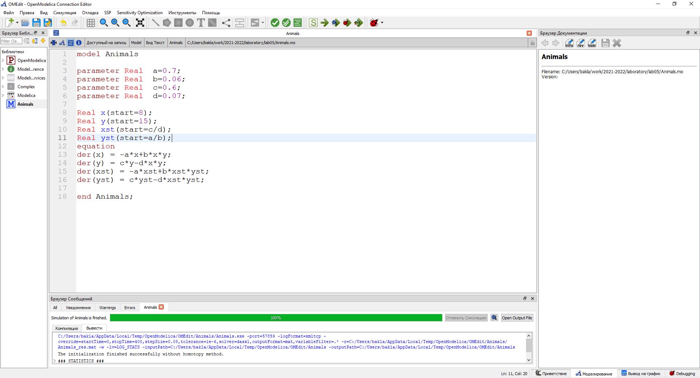
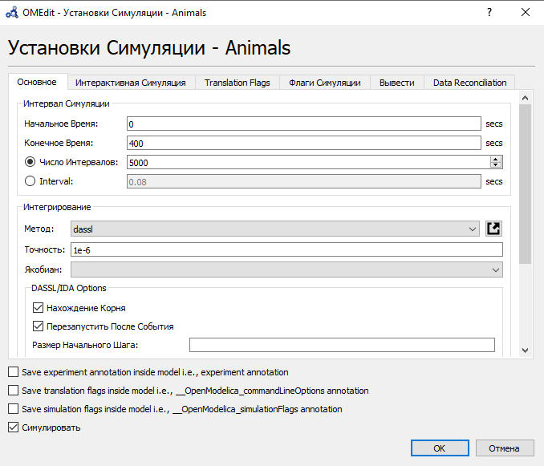
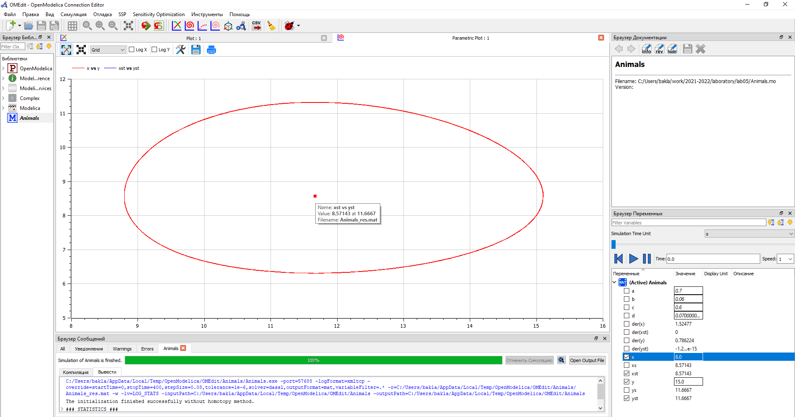
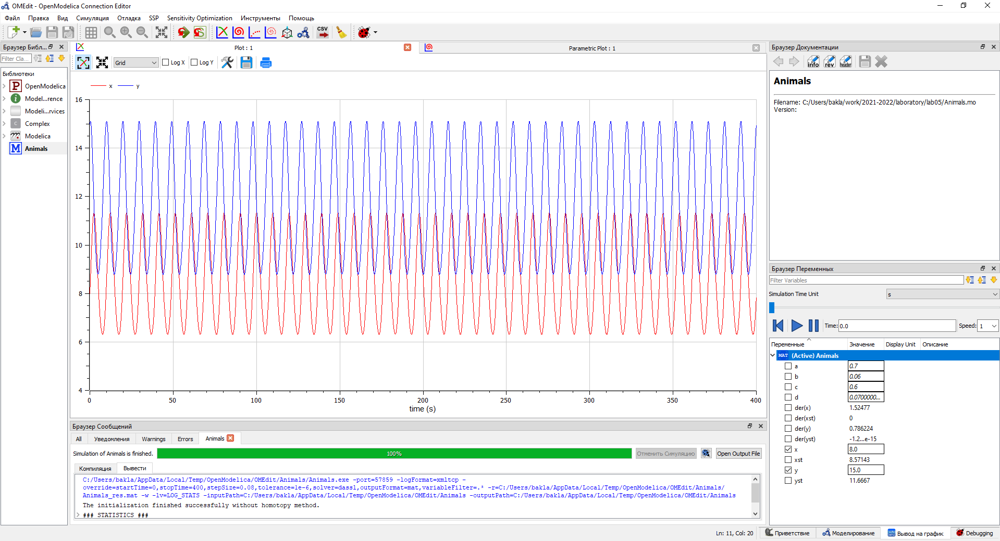
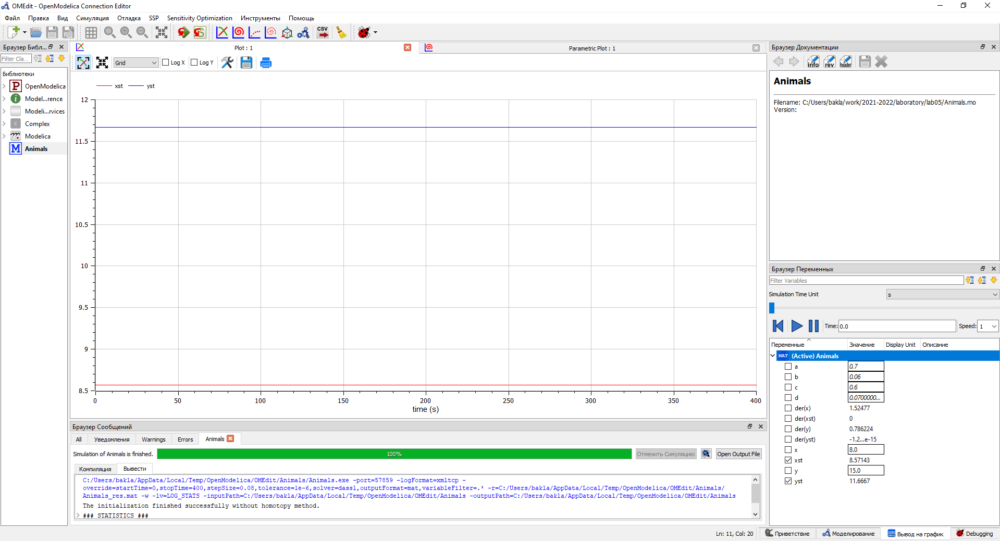

---
## Front matter
lang: ru-RU
title: Лабораторная работа №5. Модель хищник-жертва.
author: |
	Alexander S. Baklashov
institute: |
	RUDN University, Moscow, Russian Federation

date: 12 March, 2022

## Formatting
toc: false
slide_level: 2
theme: metropolis
header-includes: 
 - \metroset{progressbar=frametitle,sectionpage=progressbar,numbering=fraction}
 - '\makeatletter'
 - '\beamer@ignorenonframefalse'
 - '\makeatother'
aspectratio: 43
section-titles: true
---

# Цель работы

Рассмотреть простейшую модель взаимодействия двух видов типа «хищник — жертва» -
модель Лотки-Вольтерры. С помощью рассмотренного примера научиться решать задачи такого типа.

# Задачи

Для модели «хищник-жертва»:

Постройте график зависимости численности хищников от численности жертв, а также графики изменения численности хищников и численности жертв при начальных условиях: $x_0$, $y_0$. Найдите стационарное состояние системы.

# Задача (Вариант 38)

## Задача

Для модели «хищник-жертва»:
$$
\left\{ 
\begin{array}{c}
\frac {dx}{dt}=-0.7x(t)+0.06x(t)y(t) \\
\frac {dy}{dt}=0.6y(t)-0.07x(t)y(t) 
\end{array}
\right.
$$

Постройте график зависимости численности хищников от численности жертв,
а также графики изменения численности хищников и численности жертв при
следующих начальных условиях: $x_0$=$8$,$y_0$=$15$. Найдите стационарное
состояние системы.

# Выполнение лабораторной работы

## Код

Напишем код в OpenModelica

{ #fig:001 width=90% }

## Параметры симуляции

Зададим параметры симуляции 

{ #fig:002 width=70% }

## Графики

1. Построим график зависимости численности хищников от численности жертв, найдём стационарное
состояние системы. 

{ #fig:003 width=90% }

## Графики

2. Построим графики изменения численности хищников и численности жертв 

{ #fig:004 width=90% }

## Графики

3. Найдём стационарное состояние системы. 

{ #fig:005 width=90% }

# Выводы

В ходе данной лабораторной работы я рассмотрел простейшую модель взаимодействия двух видов типа «хищник — жертва» - модель Лотки-Вольтерры. С помощью рассмотренного примера научился решать задачи такого типа.