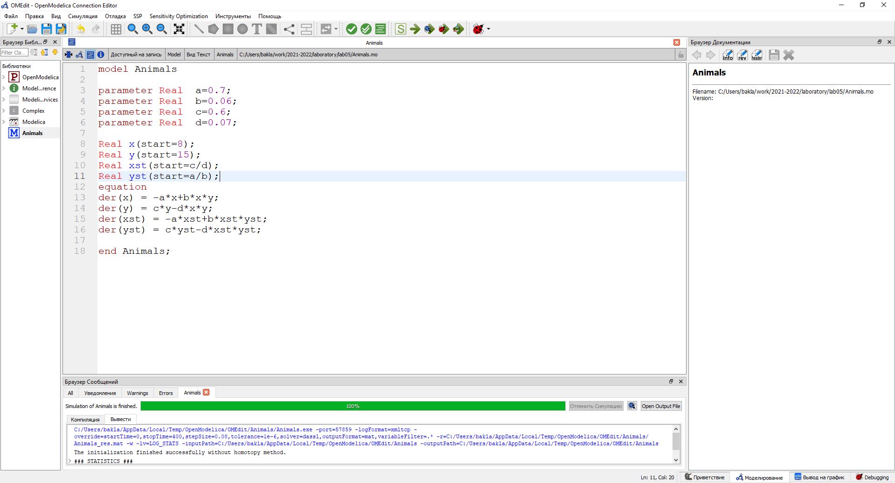
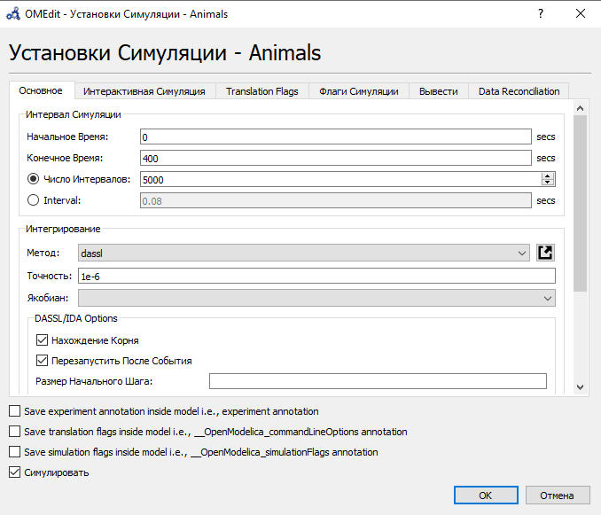
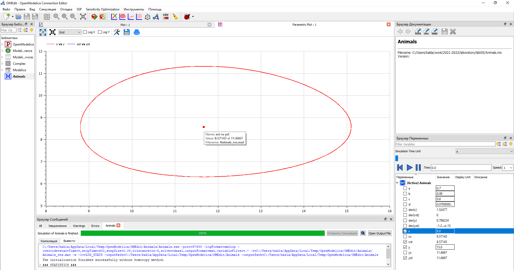
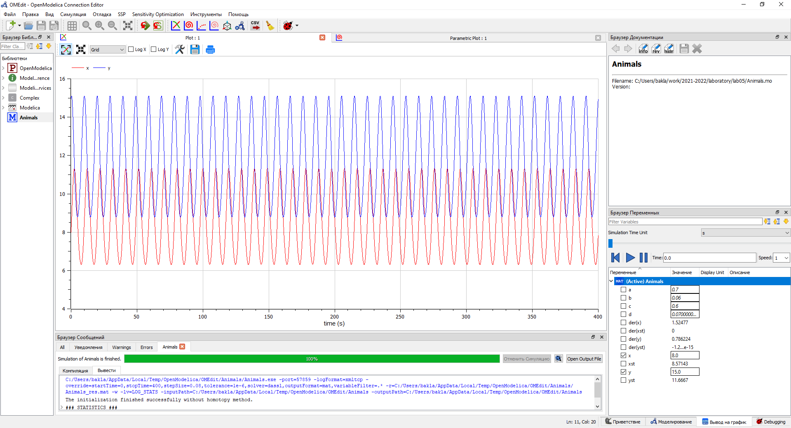
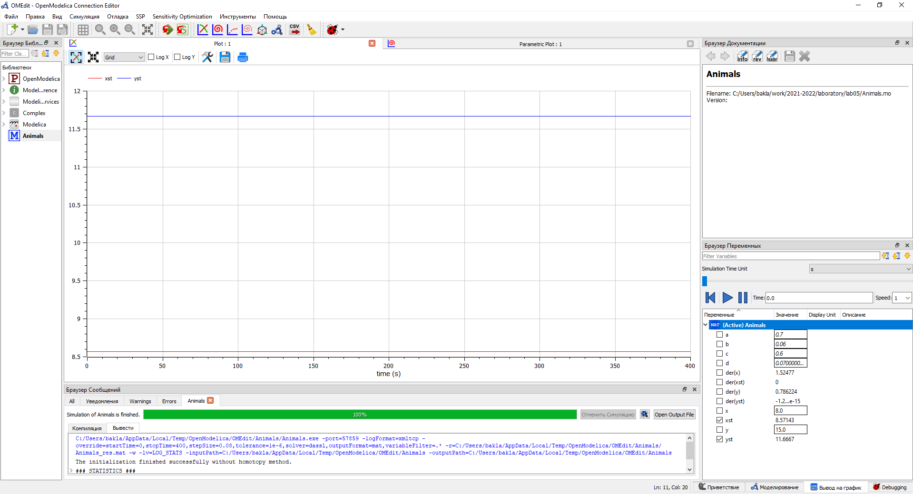

---
# Front matter
title: "Отчёт по лабораторной работе №5. Модель хищник-жертва."
subtitle: "Предмет: математическое моделирование"
author: "Александр Сергеевич Баклашов"

# Generic otions
lang: ru-RU
toc-title: "Содержание"

# Bibliography
bibliography: bib/cite.bib
csl: pandoc/csl/gost-r-7-0-5-2008-numeric.csl

# References settings
linkReferences: true
nameInLink: true

# Pdf output format
toc: true # Table of contents
toc_depth: 2
lof: true # List of figures
lot: false # List of tables
fontsize: 12pt
linestretch: 1.5
papersize: a4
documentclass: scrreprt
## I18n
polyglossia-lang:
  name: russian
  options:
	- spelling=modern
	- babelshorthands=true
polyglossia-otherlangs:
  name: english
### Fonts
mainfont: PT Serif
romanfont: PT Serif
sansfont: PT Sans
monofont: PT Mono
mainfontoptions: Ligatures=TeX
romanfontoptions: Ligatures=TeX
sansfontoptions: Ligatures=TeX,Scale=MatchLowercase
monofontoptions: Scale=MatchLowercase,Scale=0.9
## Biblatex
biblatex: true
biblio-style: "gost-numeric"
biblatexoptions:
  - parentracker=true
  - backend=biber
  - hyperref=auto
  - language=auto
  - autolang=other*
  - citestyle=gost-numeric
## Misc options
indent: true
header-includes:
  - \linepenalty=10 # the penalty added to the badness of each line within a paragraph (no associated penalty node) Increasing the value makes tex try to have fewer lines in the paragraph.
  - \interlinepenalty=0 # value of the penalty (node) added after each line of a paragraph.
  - \hyphenpenalty=50 # the penalty for line breaking at an automatically inserted hyphen
  - \exhyphenpenalty=50 # the penalty for line breaking at an explicit hyphen
  - \binoppenalty=700 # the penalty for breaking a line at a binary operator
  - \relpenalty=500 # the penalty for breaking a line at a relation
  - \clubpenalty=150 # extra penalty for breaking after first line of a paragraph
  - \widowpenalty=150 # extra penalty for breaking before last line of a paragraph
  - \displaywidowpenalty=50 # extra penalty for breaking before last line before a display math
  - \brokenpenalty=100 # extra penalty for page breaking after a hyphenated line
  - \predisplaypenalty=10000 # penalty for breaking before a display
  - \postdisplaypenalty=0 # penalty for breaking after a display
  - \floatingpenalty = 20000 # penalty for splitting an insertion (can only be split footnote in standard LaTeX)
  - \raggedbottom # or \flushbottom
  - \usepackage{float} # keep figures where there are in the text
  - \floatplacement{figure}{H} # keep figures where there are in the text
---

# Цель работы

Рассмотреть простейшую модель взаимодействия двух видов типа «хищник — жертва» -
модель Лотки-Вольтерры. С помощью рассмотренного примера научиться решать задачи такого типа.

# Задание

Для модели «хищник-жертва»:

Постройте график зависимости численности хищников от численности жертв, а также графики изменения численности хищников и численности жертв при начальных условиях: $x_0$, $y_0$. Найдите стационарное состояние системы. [3]

# Теоретическое введение

Простейшая модель взаимодействия двух видов типа «хищник — жертва» -
модель Лотки-Вольтерры. Данная двувидовая модель основывается на
следующих предположениях:
1. Численность популяции жертв и хищников зависят только от времени
(модель не учитывает пространственное распределение популяции на
занимаемой территории)
2. В отсутствии взаимодействия численность видов изменяется по модели
Мальтуса, при этом число жертв увеличивается, а число хищников падает
3. Естественная смертность жертвы и естественная рождаемость хищника
считаются несущественными
4. Эффект насыщения численности обеих популяций не учитывается
5. Скорость роста численности жертв уменьшается пропорционально
численности хищников

Данная модель описывается следующим уравнением:

$$
\left\{ 
\begin{array}{c}
\frac {dx}{dt}=-ax(t)+bx(t)y(t) \\
\frac {dy}{dt}=cy(t)-dx(t)y(t) 
\end{array}
\right.
$$

где $x$ - число хищников; $y$ - число жертв;
$a$, $d$ - коэффициенты смертности;
$b$,$c$ - коэффициенты прироста популяции.

Стационарное состояние системы (положение равновесия, не зависящее
от времени решение) будет в точке: $x_0$=$\frac {c}{d}$, $y_0$=$\frac {a}{b}$ . Если начальные значения
задать в стационарном состоянии $x(0)$=$x_0$,$y(0)$=$y_0$, то в любой момент времени численность популяций изменяться не будет. [2]

# Выполнение лабораторной работы

## Задача (Вариант 38)

Для модели «хищник-жертва»:
$$
\left\{ 
\begin{array}{c}
\frac {dx}{dt}=-0.7x(t)+0.06x(t)y(t) \\
\frac {dy}{dt}=0.6y(t)-0.07x(t)y(t) 
\end{array}
\right.
$$

Постройте график зависимости численности хищников от численности жертв,
а также графики изменения численности хищников и численности жертв при
следующих начальных условиях: $x_0$=$8$,$y_0$=$15$. Найдите стационарное
состояние системы. [3]

## Решение

### Код

Напишем код в OpenModelica [1] (рис. [-@fig:001])

{ #fig:001 width=90% }

### Параметры симуляции

Зададим параметры симуляции (рис. [-@fig:002])

{ #fig:002 width=90% }

### Графики

1. Построим график зависимости численности хищников от численности жертв, найдём стационарное
состояние системы. (рис. [-@fig:003])

{ #fig:003 width=90% }

2. Построим графики изменения численности хищников и численности жертв (рис. [-@fig:004])

{ #fig:004 width=90% }

3. Найдём стационарное
состояние системы. (рис. [-@fig:005])

{ #fig:005 width=90% }

# Выводы

В ходе данной лабораторной работы я рассмотрел простейшую модель взаимодействия двух видов типа «хищник — жертва» - модель Лотки-Вольтерры. С помощью рассмотренного примера научился решать задачи такого типа.

# Библиография

1. Modelica: Language Specification. - 308 с. [Электронный ресурс]. М. URL: [Language Specification](https://modelica.org/documents/ModelicaSpec34.pdf) (Дата обращения: 12.03.2021).

2. Лабораторная работа №5. Модель хищник-жертва. - 5 с. [Электронный ресурс]. М. URL: [Лабораторная работа №5. Модель хищник-жертва.](https://esystem.rudn.ru/pluginfile.php/1343893/mod_resource/content/2/Лабораторная%20работа%20№%204.pdf) (Дата обращения: 12.03.2021).

3. Лабораторная работа №5. Варианты. [Электронный ресурс]. М. URL: [Варианты](https://esystem.rudn.ru/pluginfile.php/1343894/mod_resource/content/2/Задание%20к%20Лабораторной%20работе%20№%203%20%281%29.pdf) (Дата обращения: 12.03.2021).
