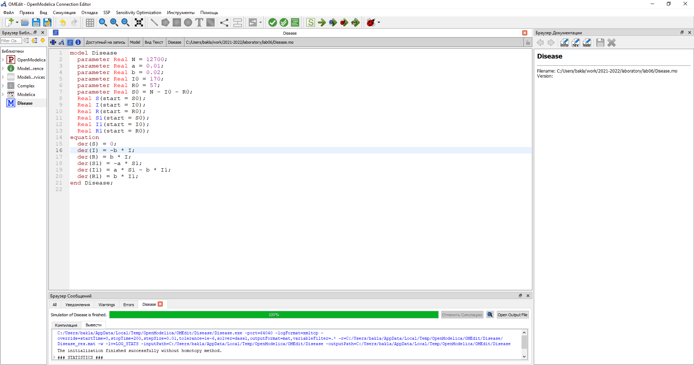
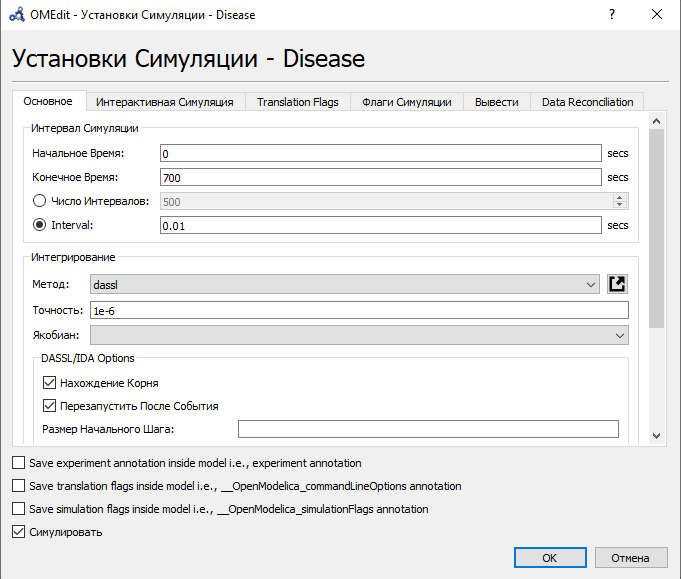
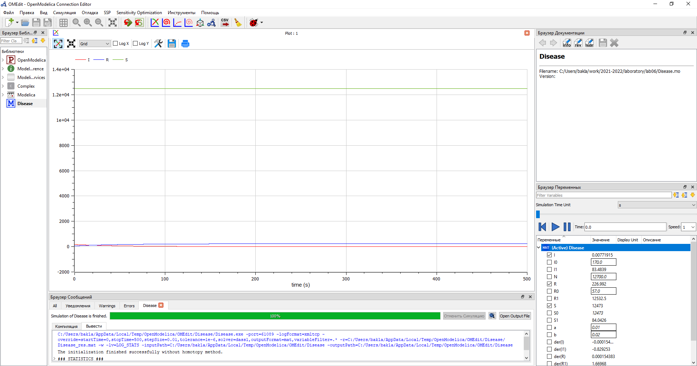
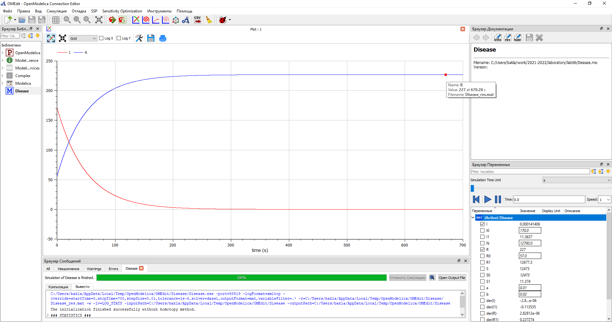
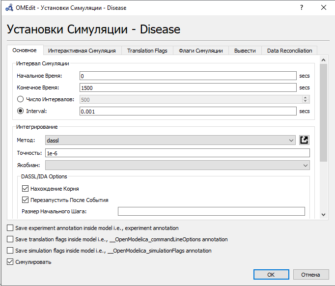
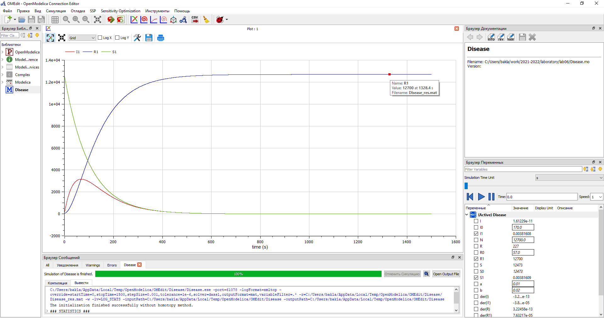

---
## Front matter
lang: ru-RU
title: Лабораторная работа №6. Задача об эпидемии.
author: |
	Alexander S. Baklashov
institute: |
	RUDN University, Moscow, Russian Federation

date: 19 March, 2022

## Formatting
toc: false
slide_level: 2
theme: metropolis
header-includes: 
 - \metroset{progressbar=frametitle,sectionpage=progressbar,numbering=fraction}
 - '\makeatletter'
 - '\beamer@ignorenonframefalse'
 - '\makeatother'
aspectratio: 43
section-titles: true
---

# Цель работы

Рассмотреть простейшую модель эпидемии. С помощью рассмотренного примера научиться решать задачи такого типа.

# Задача (Вариант 38)

## Задача

На одном острове вспыхнула эпидемия. Известно, что из всех проживающих на острове ($N=12 700$) в момент начала эпидемии ($t=0$) число заболевших людей (являющихся распространителями инфекции) 
$I(0)=170$, а число здоровых людей с иммунитетом к болезни $R(0)=57$. Таким образом, число людей восприимчивых к болезни, но пока здоровых, в начальный момент времени $S(0)=N-I(0)-R(0)$.

Постройте графики изменения числа особей в каждой из трех групп. Рассмотрите, как будет протекать эпидемия в случае:

1) если $I(0) \leq I^*$

2) если $I(0) > I^*$

# Выполнение лабораторной работы

## Код

Напишем код в OpenModelica

{ #fig:001 width=90% }

## Параметры симуляции для 1 случая

Зададим параметры симуляции для 1 случая

{ #fig:002 width=70% }

## Графики для 1 случая

Построим график изменения числа особей в каждой из трех групп для случая $I(t) \leq I^*$

{ #fig:003 width=90% }

## Графики для 1 случая

Рассмотрим изменение групп I и R поближе

{ #fig:004 width=90% }

## Графики для 1 случая

Количество инфицированных распространителей (I) со временем уменьшается, а количество здоровых особей с иммунитетов к болезни (R) - увеличивается.

## Параметры симуляции для 2 случая

Зададим параметры симуляции для 2 случая

{ #fig:005 width=70% }

## Графики для 2 случая

Построим график изменения числа особей в каждой из трех групп для случая $I(t) > I^*$

{ #fig:006 width=90% }

## Графики для 2 случая

В этом случае инфицирование особи способны заражать восприимчивых к болезни особей. Количество здоровых, но восприимчивых к болезни особей (S) со временем уменьшается и идет прирост здоровых особей с иммунитетом к болезни (R). Количество инфицированных распространителей (I) вначале увеличивается, затем уменьшается по мере роста здоровых особей с иммунитетом к болезни (R).

# Выводы

В ходе данной лабораторной работы я рассмотрел простейшую модель эпидемии. С помощью рассмотренного примера научился решать задачи такого типа.