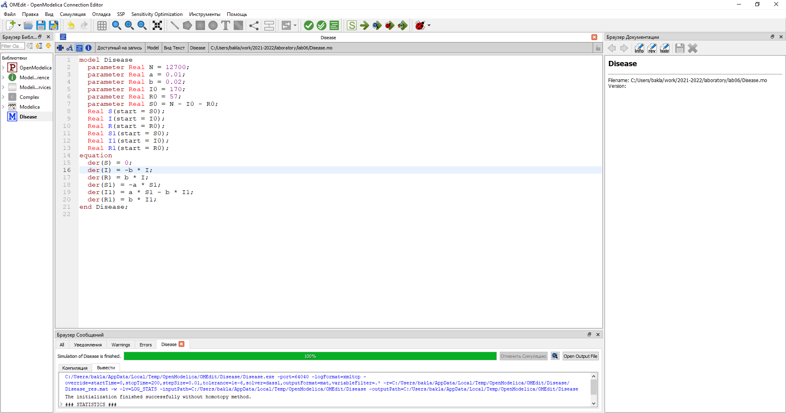
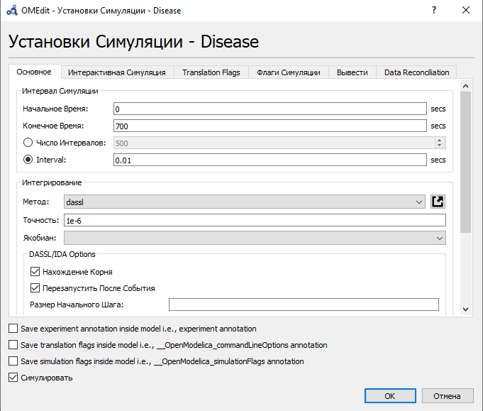
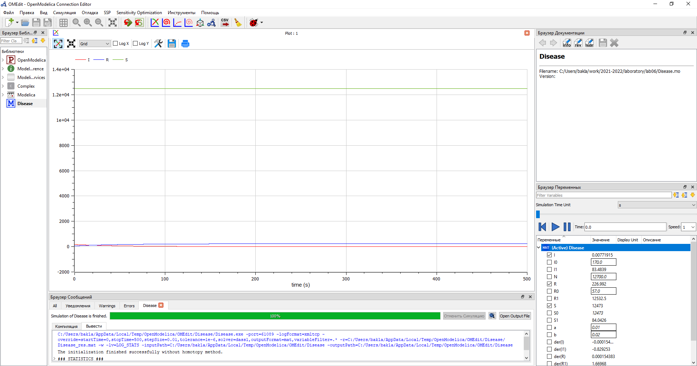
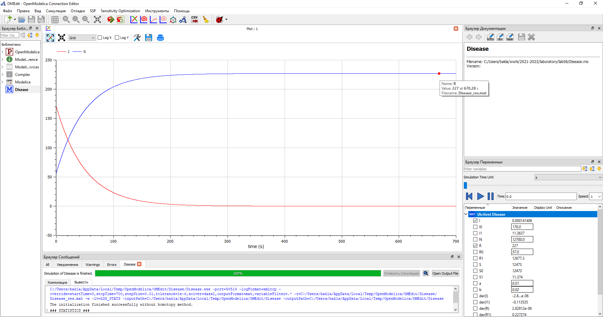
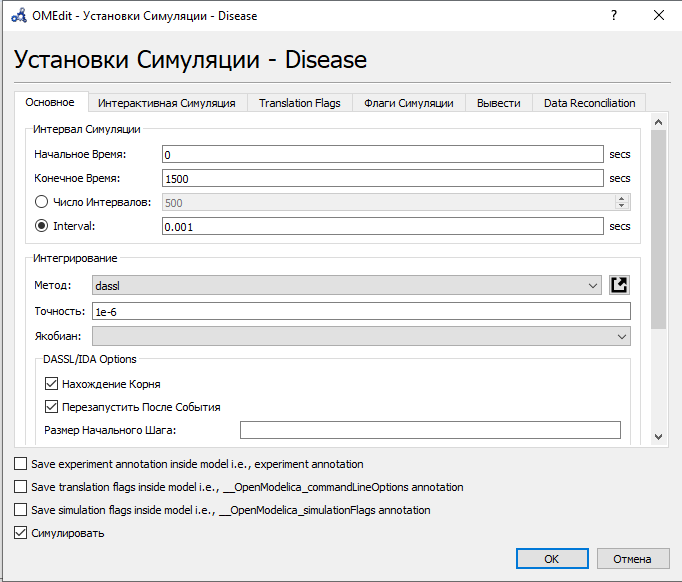
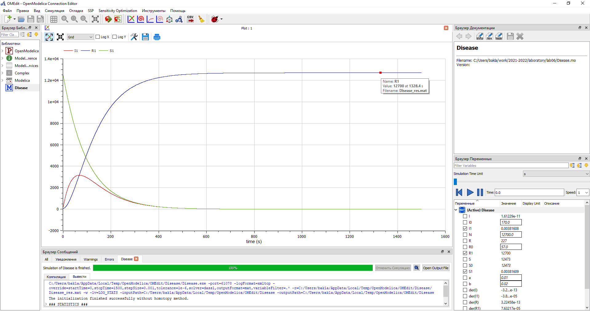

---
# Front matter
title: "Отчёт по лабораторной работе №6. Задача об эпидемии."
subtitle: "Предмет: математическое моделирование"
author: "Александр Сергеевич Баклашов"

# Generic otions
lang: ru-RU
toc-title: "Содержание"

# Bibliography
bibliography: bib/cite.bib
csl: pandoc/csl/gost-r-7-0-5-2008-numeric.csl

# References settings
linkReferences: true
nameInLink: true

# Pdf output format
toc: true # Table of contents
toc_depth: 2
lof: true # List of figures
lot: false # List of tables
fontsize: 12pt
linestretch: 1.5
papersize: a4
documentclass: scrreprt
## I18n
polyglossia-lang:
  name: russian
  options:
	- spelling=modern
	- babelshorthands=true
polyglossia-otherlangs:
  name: english
### Fonts
mainfont: PT Serif
romanfont: PT Serif
sansfont: PT Sans
monofont: PT Mono
mainfontoptions: Ligatures=TeX
romanfontoptions: Ligatures=TeX
sansfontoptions: Ligatures=TeX,Scale=MatchLowercase
monofontoptions: Scale=MatchLowercase,Scale=0.9
## Biblatex
biblatex: true
biblio-style: "gost-numeric"
biblatexoptions:
  - parentracker=true
  - backend=biber
  - hyperref=auto
  - language=auto
  - autolang=other*
  - citestyle=gost-numeric
## Misc options
indent: true
header-includes:
  - \linepenalty=10 # the penalty added to the badness of each line within a paragraph (no associated penalty node) Increasing the value makes tex try to have fewer lines in the paragraph.
  - \interlinepenalty=0 # value of the penalty (node) added after each line of a paragraph.
  - \hyphenpenalty=50 # the penalty for line breaking at an automatically inserted hyphen
  - \exhyphenpenalty=50 # the penalty for line breaking at an explicit hyphen
  - \binoppenalty=700 # the penalty for breaking a line at a binary operator
  - \relpenalty=500 # the penalty for breaking a line at a relation
  - \clubpenalty=150 # extra penalty for breaking after first line of a paragraph
  - \widowpenalty=150 # extra penalty for breaking before last line of a paragraph
  - \displaywidowpenalty=50 # extra penalty for breaking before last line before a display math
  - \brokenpenalty=100 # extra penalty for page breaking after a hyphenated line
  - \predisplaypenalty=10000 # penalty for breaking before a display
  - \postdisplaypenalty=0 # penalty for breaking after a display
  - \floatingpenalty = 20000 # penalty for splitting an insertion (can only be split footnote in standard LaTeX)
  - \raggedbottom # or \flushbottom
  - \usepackage{float} # keep figures where there are in the text
  - \floatplacement{figure}{H} # keep figures where there are in the text
---

# Цель работы

Рассмотреть простейшую модель эпидемии. С помощью рассмотренного примера научиться решать задачи такого типа.

# Задание

Предположим, что некая популяция, состоящая из $N$ особей, (считаем, что популяция изолирована)
подразделяется на три группы. Первая группа - это восприимчивые к болезни, но пока здоровые особи, обозначим их через $S(t)$. Вторая группа – это число инфицированных особей, которые также при этом являются распространителями инфекции, обозначим их $I(t)$. А третья группа, обозначающаяся через $R(t)$ – это здоровые особи с иммунитетом к болезни. До того, как число заболевших не превышает критического значения $I^*$, считаем, что все больные изолированы и не заражают здоровых. Когда $I(t) > I^*$, тогда инфицирование способны заражать восприимчивых к болезни особей.

Постройте графики изменения числа особей в каждой из трех групп. Рассмотрите, как будет протекать эпидемия в случае:

1) если $I(0) \leq I^*$

2) если $I(0) > I^*$ [3]

# Теоретическое введение

Предположим, что некая популяция, состоящая из $N$ особей, (считаем, что популяция изолирована)
подразделяется на три группы. Первая группа - это восприимчивые к болезни, но пока здоровые особи, обозначим их через $S(t)$. Вторая группа – это число инфицированных особей, которые также при этом являются распространителями инфекции, обозначим их $I(t)$. А третья группа, обозначающаяся через $R(t)$ – это здоровые особи с иммунитетом к болезни. До того, как число заболевших не превышает критического значения $I^*$, считаем, что все больные изолированы и не заражают здоровых. Когда $I(t) > I^*$, тогда инфицирование способны заражать восприимчивых к болезни особей.

Таким образом, скорость изменения числа $S(t)$ меняется по следующему
закону:

$\frac {dS}{dt}$ = $-αS$, если $I(t) > I^*$ 

$\frac {dS}{dt}$ = $0$, если $I(t) \leq I^*$

Поскольку каждая восприимчивая к болезни особь, которая, в конце концов,
заболевает, сама становится инфекционной, то скорость изменения числа
инфекционных особей представляет разность за единицу времени между
заразившимися и теми, кто уже болеет и лечится, т.е.:

$\frac {dI}{dt}$ = $αS-βI$, если $I(t) > I^*$ 

$\frac {dI}{dt}$ = $-βI$, если $I(t) \leq I^*$

А скорость изменения выздоравливающих особей (при этом приобретающие иммунитет к болезни)

$\frac {dR}{dt}$ = $βI$

Постоянные пропорциональности
α, β - это коэффициенты заболеваемости и выздоровления соответственно. Для того, чтобы решения соответствующих уравнений определялось однозначно, необходимо задать начальные условия. Считаем, что на начало эпидемии в момент времени $t = 0$ нет особей с иммунитетом к болезни $R(0)=0$, а
число инфицированных и восприимчивых к болезни особей $I(0)$ и $S(0)$ соответственно. Для анализа картины протекания эпидемии необходимо рассмотреть два случая: $I(t) \leq I^*$ и 
$I(t) > I^*$. [2]

# Выполнение лабораторной работы

## Задача (Вариант 38)

На одном острове вспыхнула эпидемия. Известно, что из всех проживающих на острове ($N=12 700$) в момент начала эпидемии ($t=0$) число заболевших людей (являющихся распространителями инфекции) 
$I(0)=170$, а число здоровых людей с иммунитетом к болезни $R(0)=57$. Таким образом, число людей восприимчивых к болезни, но пока здоровых, в начальный момент времени $S(0)=N-I(0)-R(0)$.

Постройте графики изменения числа особей в каждой из трех групп. Рассмотрите, как будет протекать эпидемия в случае:

1) если $I(0) \leq I^*$

2) если $I(0) > I^*$ [3]

## Решение

### Код

Напишем код в OpenModelica [1] (рис. [-@fig:001])

{ #fig:001 width=100% }

### Параметры симуляции для 1 случая

Зададим параметры симуляции для 1 случая (рис. [-@fig:002])

{ #fig:002 width=90% }

### График для 1 случая

Построим график изменения числа особей в каждой из трех групп для случая $I(t) \leq I^*$.  (рис. [-@fig:003])

{ #fig:003 width=90% }

Как мы видим на графике, в этом случае все больные изолированы и не заражают здоровых.

Рассмотрим изменение групп I и R поближе. Количество инфицированных распространителей (I) со временем уменьшается, а количество здоровых особей с иммунитетов к болезни (R) - увеличивается.

{ #fig:004 width=90% }

### Параметры симуляции для 2 случая

Зададим параметры симуляции для 2 случая (рис. [-@fig:006])

{ #fig:006 width=90% }

### График для 2 случая

Построим график изменения числа особей в каждой из трех групп для случая $I(t) > I^*$. (рис. [-@fig:005])

Как мы видим на графике, в этом случае инфицирование особи способны заражать восприимчивых к болезни особей. Количество здоровых, но восприимчивых к болезни особей (S) со временем уменьшается и идет прирост здоровых особей с иммунитетом к болезни (R). Количество инфицированных распространителей (I) вначале увеличивается, затем уменьшается по мере роста здоровых особей с иммунитетом к болезни (R).

{ #fig:005 width=90% }

# Выводы

В ходе данной лабораторной работы я рассмотрел простейшую модель эпидемии. С помощью рассмотренного примера научился решать задачи такого типа.

# Библиография

1. Modelica: Language Specification. - 308 с. [Электронный ресурс]. М. URL: [Language Specification](https://modelica.org/documents/ModelicaSpec34.pdf) (Дата обращения: 18.03.2021).

2. Лабораторная работа №6. Задача об эпидемии. - 4 с. [Электронный ресурс]. М. URL: [Лабораторная работа №6. Задача об эпидемии.](https://esystem.rudn.ru/pluginfile.php/1343897/mod_resource/content/2/Лабораторная%20работа%20№%205.pdf) (Дата обращения: 18.03.2021).

3. Лабораторная работа №6. Варианты. [Электронный ресурс]. М. URL: [Варианты](https://esystem.rudn.ru/pluginfile.php/1343898/mod_resource/content/2/Задание%20к%20лабораторной%20работе%20№%207%20%283%29.pdf) (Дата обращения: 18.03.2021).
