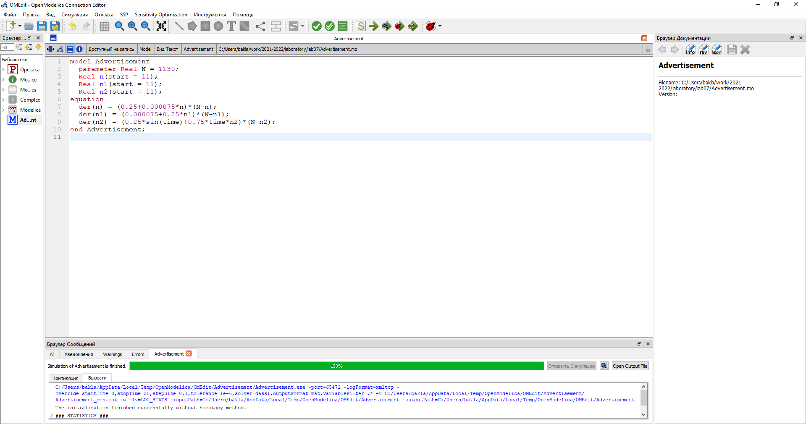
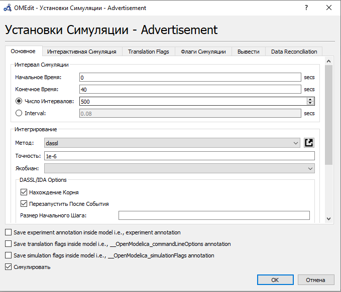
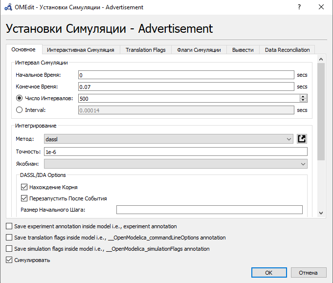
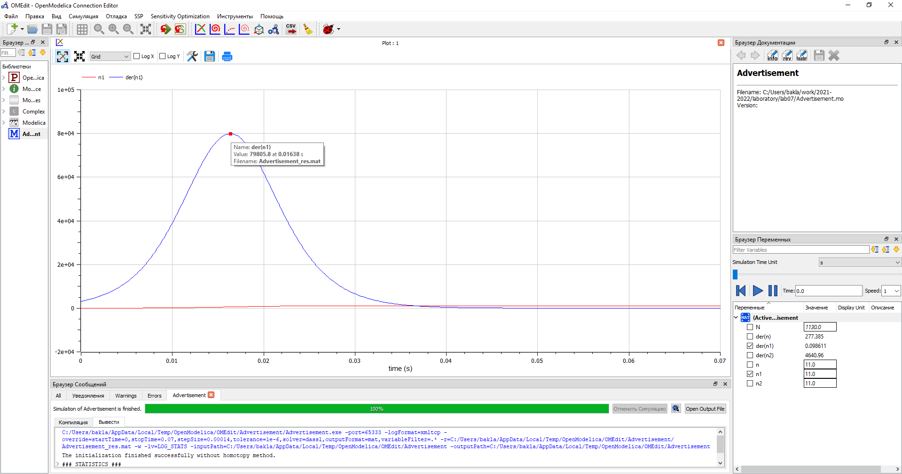
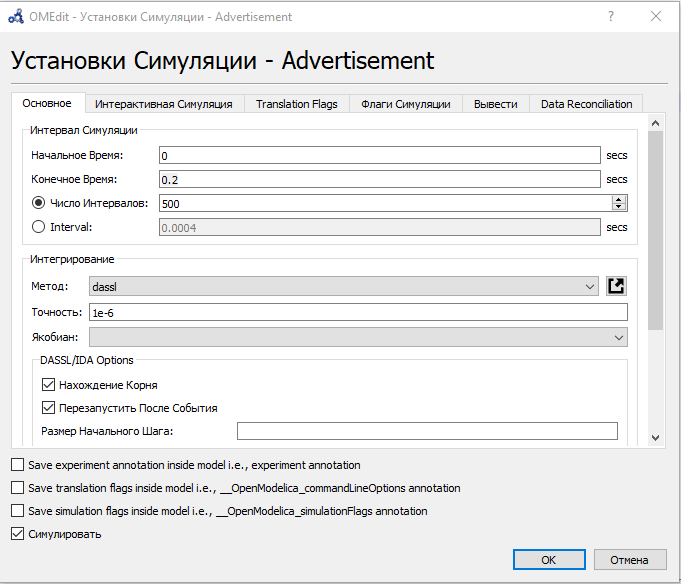
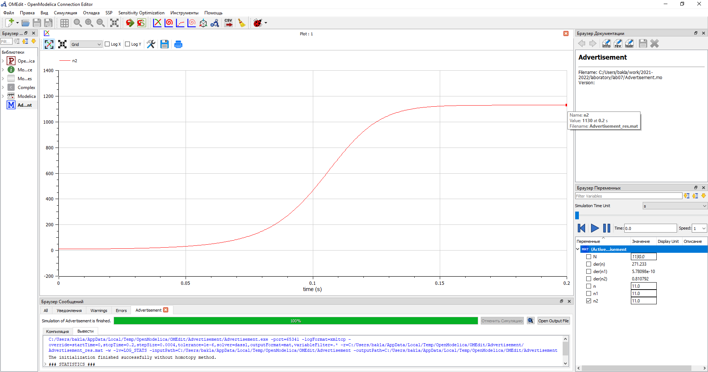

---
## Front matter
lang: ru-RU
title: Лабораторная работа №7. Эффективность рекламы.
author: |
	Alexander S. Baklashov
institute: |
	RUDN University, Moscow, Russian Federation

date: 26 March, 2022

## Formatting
toc: false
slide_level: 2
theme: metropolis
header-includes: 
 - \metroset{progressbar=frametitle,sectionpage=progressbar,numbering=fraction}
 - '\makeatletter'
 - '\beamer@ignorenonframefalse'
 - '\makeatother'
aspectratio: 43
section-titles: true
---

# Цель работы

Рассмотреть математическую модель распространения рекламы. С помощью рассмотренной модели и теоретических данных научиться строить модели такого типа.

# Задача (Вариант 38)

## Задача

Постройте график распространения рекламы, математическая модель которой описывается
следующим уравнением:

1. $\frac {dn}{dt}$=$(0.25+0.000075n(t))(N-n(t))$

2. $\frac {dn}{dt}$=$(0.000075+0.25n(t))(N-n(t))$

3. $\frac {dn}{dt}$=$(0.25sin(t)+0.75*t*n(t))(N-n(t))$

При этом объем аудитории $N=1130$, в начальный момент о товаре знает $11$ человек. Для
случая $2$ определите в какой момент времени скорость распространения рекламы будет иметь максимальное значение.

# Выполнение лабораторной работы

## Код

Напишем код в OpenModelica 

{ #fig:001 width=100% }

## Параметры симуляции для 1 случая

Зададим параметры симуляции для 1 случая 

{ #fig:002 width=70% }

## График для 1 случая

Построим график распространения рекламы для 1 случая. В данном случае $α_1(t)≫α_2(t)$, следовательно, получаем модель типа модели Мальтуса.

{ #fig:003 width=90% }

## Параметры симуляции для 2 случая

Зададим параметры симуляции для 2 случая 

{ #fig:004 width=70% }

## График для 2 случая

Построим график распространения рекламы для 2 случая. В данном случае $α_1(t)≪α_2(t)$, следовательно, получаем уравнение логистической кривой.

{ #fig:005 width=90% }

## График для 2 случая

Определим в какой момент времени скорость распространения рекламы будет иметь максимальное значение ($t=0.01638$). 

{ #fig:006 width=90% }

## Параметры симуляции для 3 случая

Зададим параметры симуляции для 3 случая 

{ #fig:007 width=70% }

## График для 3 случая

Построим график распространения рекламы для 3 случая.

{ #fig:008 width=90% }

# Выводы

В ходе данной лабораторной работы я рассмотрел математическую модель распространения рекламы. С помощью рассмотренной модели и теоретических данных научился строить модели такого типа.