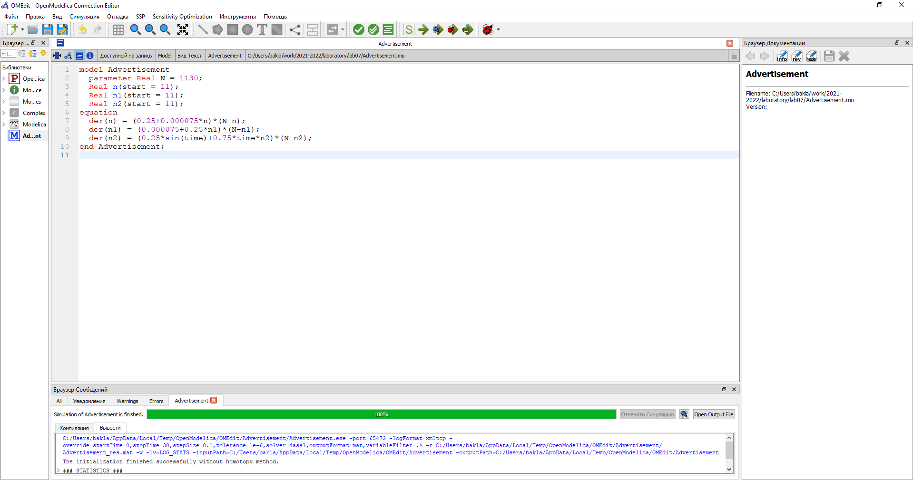
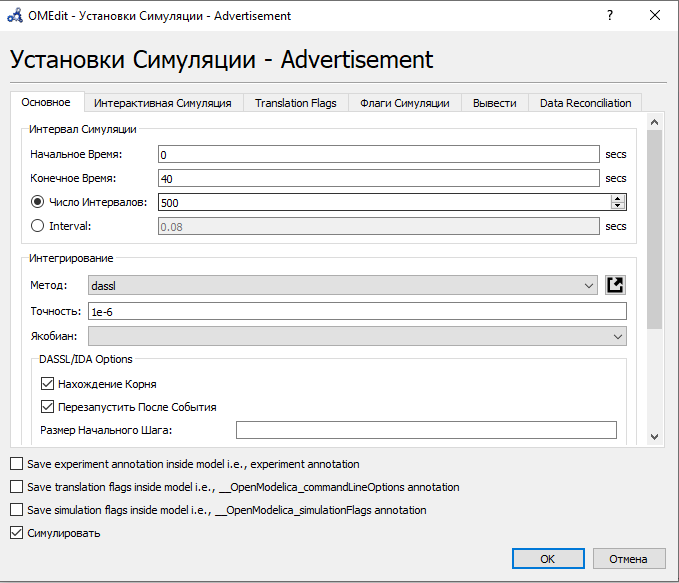
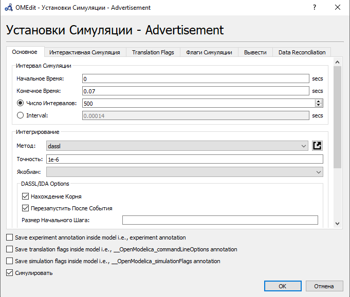
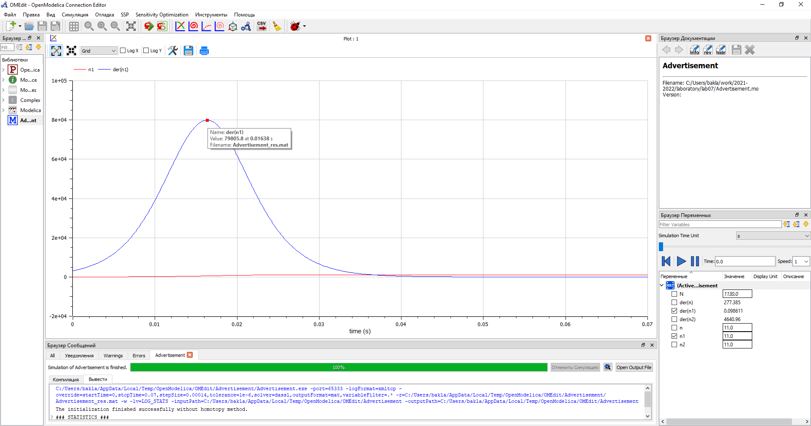
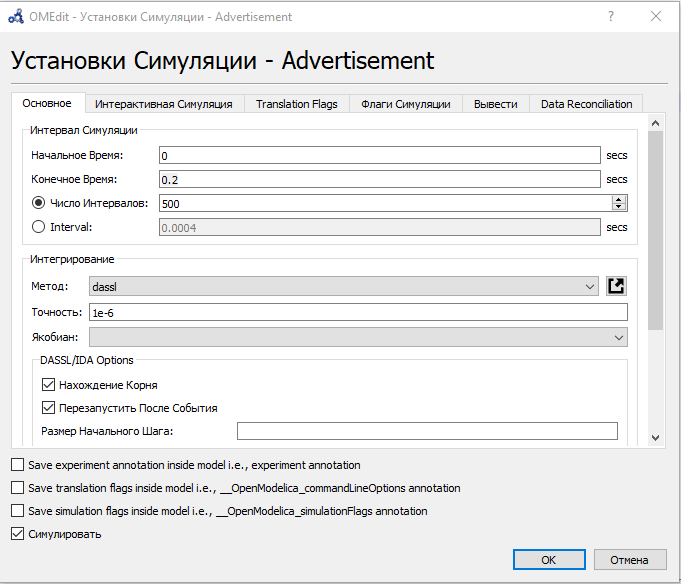
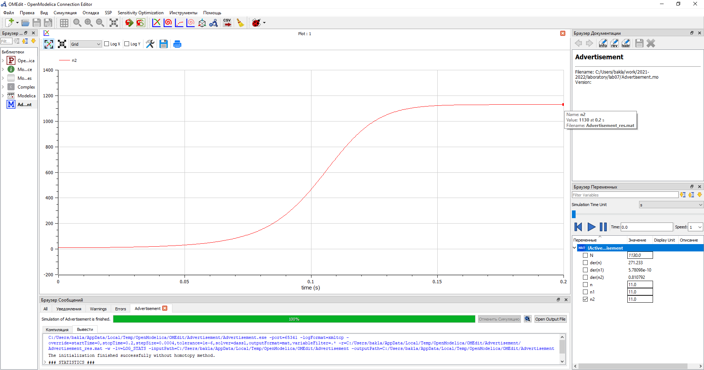

---
# Front matter
title: "Отчёт по лабораторной работе №7. Эффективность рекламы."
subtitle: "Предмет: математическое моделирование"
author: "Александр Сергеевич Баклашов"

# Generic otions
lang: ru-RU
toc-title: "Содержание"

# Bibliography
bibliography: bib/cite.bib
csl: pandoc/csl/gost-r-7-0-5-2008-numeric.csl

# References settings
linkReferences: true
nameInLink: true

# Pdf output format
toc: true # Table of contents
toc_depth: 2
lof: true # List of figures
lot: false # List of tables
fontsize: 12pt
linestretch: 1.5
papersize: a4
documentclass: scrreprt
## I18n
polyglossia-lang:
  name: russian
  options:
	- spelling=modern
	- babelshorthands=true
polyglossia-otherlangs:
  name: english
### Fonts
mainfont: PT Serif
romanfont: PT Serif
sansfont: PT Sans
monofont: PT Mono
mainfontoptions: Ligatures=TeX
romanfontoptions: Ligatures=TeX
sansfontoptions: Ligatures=TeX,Scale=MatchLowercase
monofontoptions: Scale=MatchLowercase,Scale=0.9
## Biblatex
biblatex: true
biblio-style: "gost-numeric"
biblatexoptions:
  - parentracker=true
  - backend=biber
  - hyperref=auto
  - language=auto
  - autolang=other*
  - citestyle=gost-numeric
## Misc options
indent: true
header-includes:
  - \linepenalty=10 # the penalty added to the badness of each line within a paragraph (no associated penalty node) Increasing the value makes tex try to have fewer lines in the paragraph.
  - \interlinepenalty=0 # value of the penalty (node) added after each line of a paragraph.
  - \hyphenpenalty=50 # the penalty for line breaking at an automatically inserted hyphen
  - \exhyphenpenalty=50 # the penalty for line breaking at an explicit hyphen
  - \binoppenalty=700 # the penalty for breaking a line at a binary operator
  - \relpenalty=500 # the penalty for breaking a line at a relation
  - \clubpenalty=150 # extra penalty for breaking after first line of a paragraph
  - \widowpenalty=150 # extra penalty for breaking before last line of a paragraph
  - \displaywidowpenalty=50 # extra penalty for breaking before last line before a display math
  - \brokenpenalty=100 # extra penalty for page breaking after a hyphenated line
  - \predisplaypenalty=10000 # penalty for breaking before a display
  - \postdisplaypenalty=0 # penalty for breaking after a display
  - \floatingpenalty = 20000 # penalty for splitting an insertion (can only be split footnote in standard LaTeX)
  - \raggedbottom # or \flushbottom
  - \usepackage{float} # keep figures where there are in the text
  - \floatplacement{figure}{H} # keep figures where there are in the text
---

# Цель работы

Рассмотреть математическую модель распространения рекламы. С помощью рассмотренной модели и теоретических данных научиться строить модели такого типа.

# Задание

В городе открылся новый салон красоты. Полагаем, что на момент открытия о салоне знали $N_0$ потенциальных клиентов. По маркетинговым исследованиям известно, что в районе проживают $N$ потенциальных клиентов салона. Поэтому после открытия салона руководитель запускает активную рекламную кампанию. После этого скорость изменения числа знающих о салоне пропорциональна как числу знающих о нем, так и числу не знающих о нем.

Построить график распространения рекламы, математическая модель которой описывается
данным уравнением (3 случая). [3]

# Теоретическое введение

Организуется рекламная кампания нового товара или услуги. Необходимо, чтобы прибыль будущих продаж с избытком покрывала издержки на рекламу. Вначале расходы могут превышать прибыль, поскольку лишь малая часть потенциальных покупателей будет информирована о новинке. Затем, при
увеличении числа продаж, возрастает и прибыль, и, наконец, наступит момент, когда рынок насытиться, и рекламировать товар станет бесполезным. 

Предположим, что торговыми учреждениями реализуется некоторая продукция, о которой в момент времени $t$ из числа потенциальных покупателей $N$ знает лишь $n$ покупателей. Для ускорения сбыта продукции запускается реклама по радио, телевидению и других средств массовой информации. После запуска рекламной кампании информация о продукции начнет распространяться среди потенциальных покупателей путем общения друг с другом. Таким образом, после запуска рекламных объявлений скорость изменения числа знающих о продукции людей пропорциональна как числу знающих о товаре покупателей, так и числу покупателей о нем не знающих.

Модель рекламной кампании описывается следующими величинами. Считаем, что $\frac {dn}{dt}$ - скорость изменения со временем числа потребителей, узнавших о товаре и готовых его купить, $t$ - время, прошедшее с начала рекламной кампании, $n(t)$ - число уже информированных клиентов. Эта величина пропорциональна числу покупателей, еще не знающих о нем, это описывается следующим образом: $α_1(t)(N-n(t))$, где $N$ - общее число потенциальных платежеспособных покупателей,$α_1(t)>0$ - характеризует интенсивность рекламной кампании (зависит от затрат на рекламу в данный момент времени). Помимо этого, узнавшие о товаре потребители также распространяют полученную информацию среди потенциальных покупателей, не знающих о нем (в этом случае работает т.н. сарафанное радио). Этот вклад в рекламу описывается величиной $α_2(t)(N-n(t))$ , эта величина увеличивается с увеличением потребителей узнавших о товаре. Математическая модель распространения рекламы описывается уравнением: 

$\frac {dn}{dt}$=$(α_1(t)+α_2(t)n(t))(N-n(t))$.

При $α_1(t)≫α_2(t)$ получается модель типа модели Мальтуса.

В обратном случае, при $α_1(t)≪α_2(t)$ получаем уравнение логистической кривой. [2]

# Выполнение лабораторной работы

## Задача (Вариант 38)

Постройте график распространения рекламы, математическая модель которой описывается
следующим уравнением:
1. $\frac {dn}{dt}$=$(0.25+0.000075n(t))(N-n(t))$

2. $\frac {dn}{dt}$=$(0.000075+0.25n(t))(N-n(t))$

3. $\frac {dn}{dt}$=$(0.25sin(t)+0.75*t*n(t))(N-n(t))$

При этом объем аудитории $N=1130$, в начальный момент о товаре знает $11$ человек. Для
случая $2$ определите в какой момент времени скорость распространения рекламы будет иметь максимальное значение. [3]

## Решение

### Код

Напишем код в OpenModelica [1] (рис. [-@fig:001])

{ #fig:001 width=100% }

### Параметры симуляции для 1 случая

Зададим параметры симуляции для 1 случая (рис. [-@fig:002])

{ #fig:002 width=90% }

### График для 1 случая

Построим график распространения рекламы для 1 случая.  (рис. [-@fig:003])

{ #fig:003 width=90% }

В данном случае $α_1(t)≫α_2(t)$, следовательно, получаем модель типа модели Мальтуса.

### Параметры симуляции для 2 случая

Зададим параметры симуляции для 2 случая (рис. [-@fig:004])

{ #fig:004 width=90% }

### График для 2 случая

Построим график распространения рекламы для 2 случая. (рис. [-@fig:005])

{ #fig:005 width=90% }

В данном случае $α_1(t)≪α_2(t)$, следовательно, получаем уравнение логистической кривой.

Определим в какой момент времени скорость распространения рекламы будет иметь максимальное значение. (рис. [-@fig:006])

{ #fig:006 width=90% }

### Параметры симуляции для 3 случая

Зададим параметры симуляции для 3 случая (рис. [-@fig:007])

{ #fig:007 width=90% }

### График для 3 случая

Построим график распространения рекламы для 3 случая.  (рис. [-@fig:008])

{ #fig:008 width=90% }

# Выводы

В ходе данной лабораторной работы я рассмотрел математическую модель распространения рекламы. С помощью рассмотренной модели и теоретических данных научился строить модели такого типа.

# Библиография

1. Modelica: Language Specification. - 308 с. [Электронный ресурс]. М. URL: [Language Specification](https://modelica.org/documents/ModelicaSpec34.pdf) (Дата обращения: 25.03.2021).

2. Лабораторная работа №7. Эффективность рекламы. - 5 с. [Электронный ресурс]. М. URL: [Лабораторная работа №7. Эффективность рекламы.](https://esystem.rudn.ru/pluginfile.php/1343901/mod_resource/content/2/Лабораторная%20работа%20№%206.pdf) (Дата обращения: 25.03.2021).

3. Лабораторная работа №7. Варианты. [Электронный ресурс]. М. URL: [Варианты](https://esystem.rudn.ru/pluginfile.php/1343902/mod_resource/content/2/Задание%20к%20лабораторной%20работе%20№%202%20%20%281%29.pdf) (Дата обращения: 25.03.2021).
