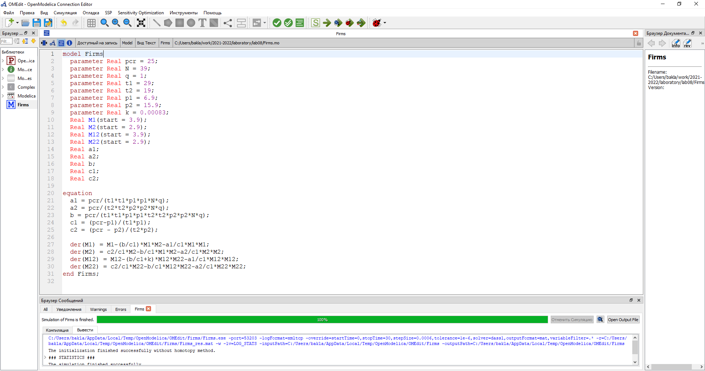
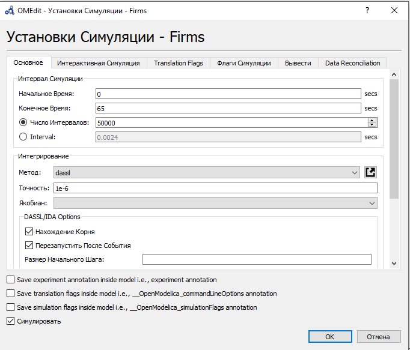
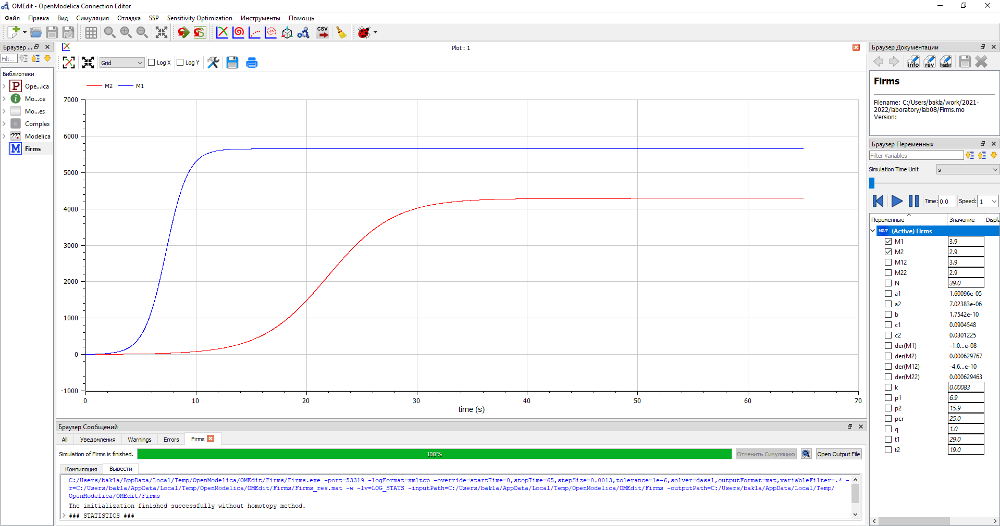
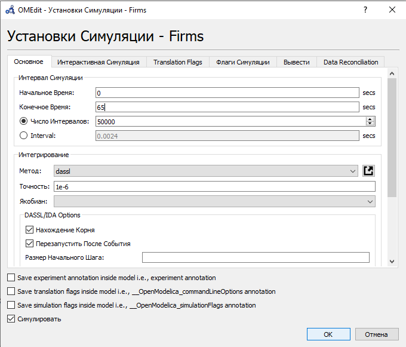
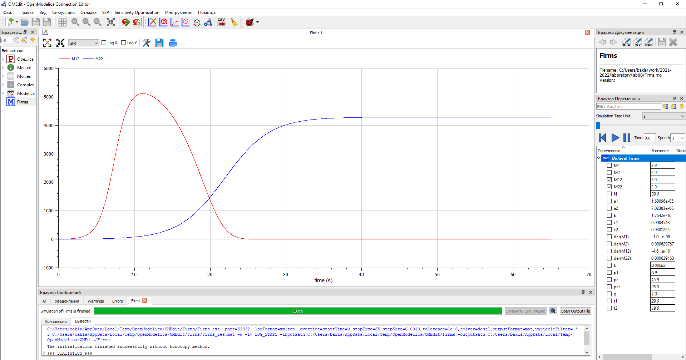

---
## Front matter
lang: ru-RU
title: Лабораторная работа №8. Модель конкуренции двух фирм.
author: |
	Alexander S. Baklashov
institute: |
	RUDN University, Moscow, Russian Federation

date: 02 April, 2022

## Formatting
toc: false
slide_level: 2
theme: metropolis
header-includes: 
 - \metroset{progressbar=frametitle,sectionpage=progressbar,numbering=fraction}
 - '\makeatletter'
 - '\beamer@ignorenonframefalse'
 - '\makeatother'
aspectratio: 43
section-titles: true
---

# Цель работы

Рассмотреть математическую модель конкуренции двух фирм. С помощью рассмотренной модели и теоретических данных научиться строить модели такого типа.

# Задача (Вариант 38)

## Задача

Случай 1. Рассмотрим две фирмы, производящие взаимозаменяемые товары
одинакового качества и находящиеся в одной рыночной нише. Считаем, что в рамках
нашей модели конкурентная борьба ведётся только рыночными методами. То есть,
конкуренты могут влиять на противника путем изменения параметров своего
производства: себестоимость, время цикла, но не могут прямо вмешиваться в
ситуацию на рынке («назначать» цену или влиять на потребителей каким-либо иным
способом.) Будем считать, что постоянные издержки пренебрежимо малы, и в
модели учитывать не будем. В этом случае динамика изменения объемов продаж
фирмы 1 и фирмы 2 описывается следующей системой уравнений:

## Задача

$\frac {dM_1}{dθ}$=$M_1-\frac{b}{c_1}M_1M_2-\frac{a_1}{c_1}M_1^2$

$\frac {dM_2}{dθ}$=$\frac{c_2}{c_1}M_2-\frac{b}{c_1}M_1M_2-\frac{a_2}{c_1}M_2^2$

где

$a_1$=$\frac {p_{cr}}{τ_1^2\widetilde{p}_1^2Nq}$; $a_2$=$\frac {p_{cr}}{τ_2^2\widetilde{p}_2^2Nq}$; $b$=$\frac {p_{cr}}{τ_1^2\widetilde{p}_1^2τ_2^2\widetilde{p}_2^2Nq}$; $c_1$=$\frac {p_{cr}-\widetilde{p}_1}{τ_1\widetilde{p}}$; $c_2$=$\frac {p_{cr}-\widetilde{p}_2}{τ_2\widetilde{p}}$

Также введена нормировка $t$=$c_1θ$.

## Задача

Случай 2. Рассмотрим модель, когда, помимо экономического фактора
влияния (изменение себестоимости, производственного цикла, использование
кредита и т.п.), используются еще и социально-психологические факторы –
формирование общественного предпочтения одного товара другому, не зависимо от
их качества и цены. В этом случае взаимодействие двух фирм будет зависеть друг
от друга, соответственно коэффициент перед $M_1M_2$ будет отличаться. Пусть в
рамках рассматриваемой модели динамика изменения объемов продаж фирмы 1 и
фирмы 2 описывается следующей системой уравнений: 

$\frac {dM_1}{dθ}$=$M_1-\frac{b}{c_1}M_1M_2-\frac{a_1}{c_1}M_1^2$

$\frac {dM_2}{dθ}$=$\frac{c_2}{c_1}M_2-(\frac{b}{c_1}+0.00083)M_1M_2-\frac{a_2}{c_1}M_2^2$

## Задача

Для обоих случаев рассмотрим задачу со следующими начальными условиями и параметрами:

$M_0^1$=$3.9$, $M_0^2$=$2.9$, $p_{cr}$=$25$, $N$=$39$, $q$=$1$, $τ_1$=$29$, $τ_2$=$19$, $\widetilde{p}_1$=$6.9$, $\widetilde{p}_2$=$15.9$. 

Обозначения:

$N$ – число потребителей производимого продукта; 
$τ$ – длительность производственного цикла; 
$p$ – рыночная цена товара; 
$\widetilde{p}$ – себестоимость продукта, то есть переменные издержки на производство единицы продукции; 
$q$ – максимальная потребность одного человека в продукте в единицу времени; 
$M$ – оборотные средства предприятия; 

$θ$ = $\frac{t}{c_1}$ 

## Задача

1. Постройте графики изменения оборотных средств фирмы 1 и фирмы 2 без учета постоянных издержек и с введенной нормировкой для случая 1.
2. Постройте графики изменения оборотных средств фирмы 1 и фирмы 2 без учета постоянных издержек и с введенной нормировкой для случая 2.

# Выполнение лабораторной работы

## Код

Напишем код в OpenModelica 

{ #fig:001 width=100% }

## Параметры симуляции для 1 случая

Зададим параметры симуляции для 1 случая 

{ #fig:002 width=70% }

## График для 1 случая

Построим график изменения оборотных средств фирмы 1 и фирмы 2 для 1 случая. По графику видно, что рост оборотных средств предприятий идет независимо друг от друга. Каждая фирма достигает свое максимальное значение объема продаж и остается на рынке с этим значением, то есть каждая фирма захватывает свою часть рынка потребителей, которая не изменяется. 

{ #fig:003 width=70% }

## Параметры симуляции для 2 случая

Зададим параметры симуляции для 2 случая 

{ #fig:004 width=70% }

## График для 2 случая

Построим график изменения оборотных средств фирмы 1 и фирмы 2 для 2 случая. По графику видно, что первая фирма, несмотря на начальный рост, достигнув своего максимального объема продаж, начитает нести убытки и, в итоге, терпит банкротство. Динамика роста объемов оборотных средств второй фирмы остается без изменения: достигнув максимального значения, остается на этом уровне.

{ #fig:005 width=70% }

# Выводы

В ходе данной лабораторной работы я рассмотрел математическую модель конкуренции двух фирм. С помощью рассмотренной модели и теоретических данных научился строить модели такого типа.