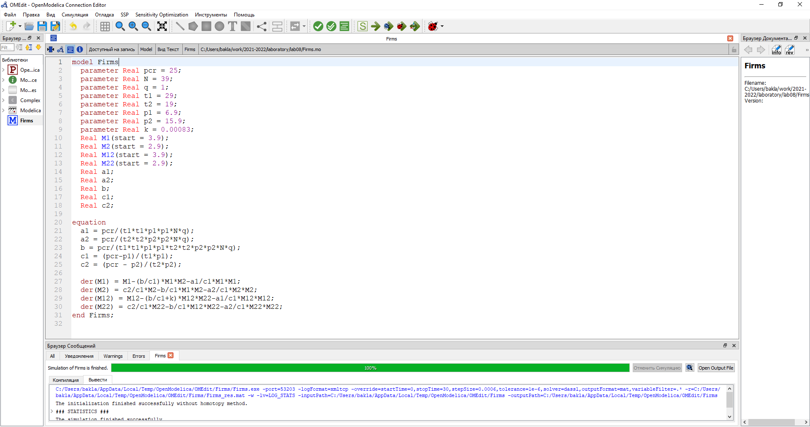
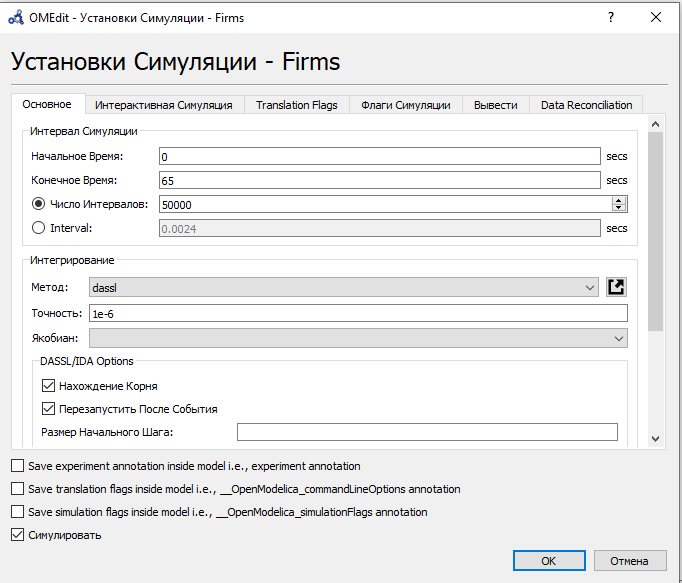
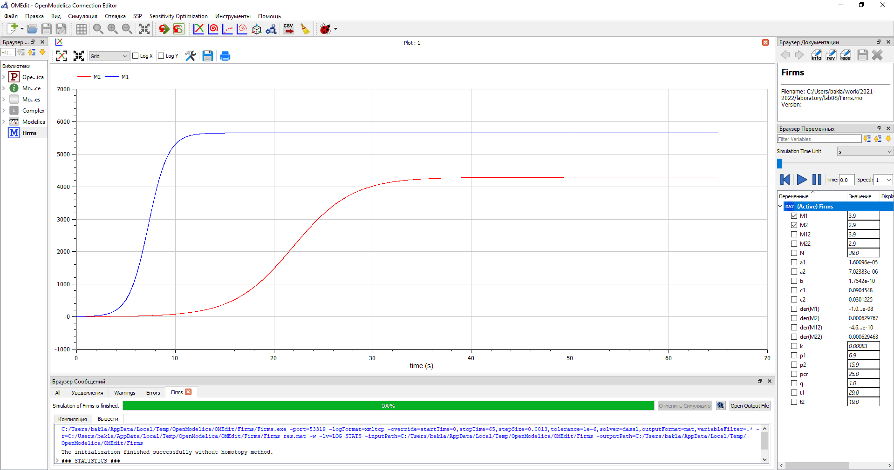
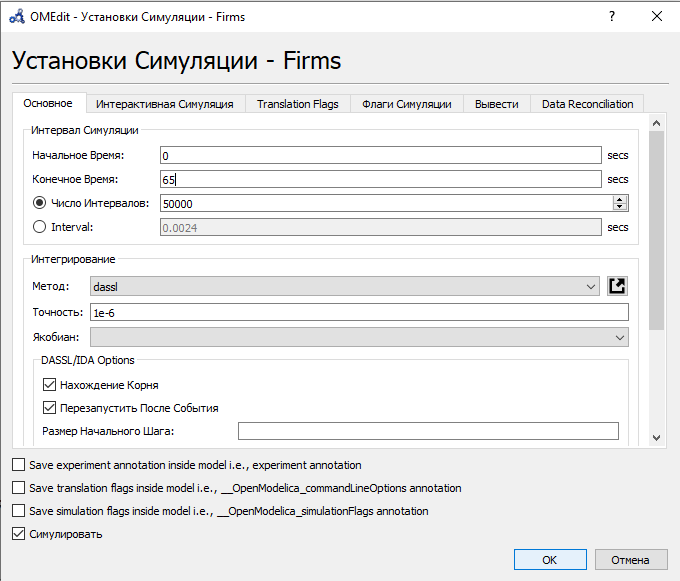
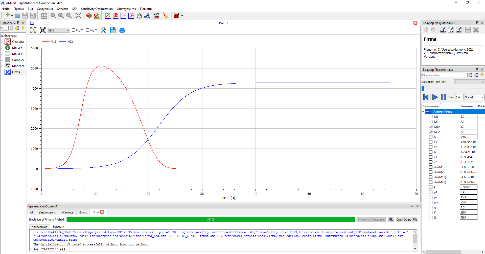

---
# Front matter
title: "Отчёт по лабораторной работе №8. Модель конкуренции двух фирм."
subtitle: "Предмет: математическое моделирование"
author: "Александр Сергеевич Баклашов"

# Generic otions
lang: ru-RU
toc-title: "Содержание"

# Bibliography
bibliography: bib/cite.bib
csl: pandoc/csl/gost-r-7-0-5-2008-numeric.csl

# References settings
linkReferences: true
nameInLink: true

# Pdf output format
toc: true # Table of contents
toc_depth: 2
lof: true # List of figures
lot: false # List of tables
fontsize: 12pt
linestretch: 1.5
papersize: a4
documentclass: scrreprt
## I18n
polyglossia-lang:
  name: russian
  options:
	- spelling=modern
	- babelshorthands=true
polyglossia-otherlangs:
  name: english
### Fonts
mainfont: PT Serif
romanfont: PT Serif
sansfont: PT Sans
monofont: PT Mono
mainfontoptions: Ligatures=TeX
romanfontoptions: Ligatures=TeX
sansfontoptions: Ligatures=TeX,Scale=MatchLowercase
monofontoptions: Scale=MatchLowercase,Scale=0.9
## Biblatex
biblatex: true
biblio-style: "gost-numeric"
biblatexoptions:
  - parentracker=true
  - backend=biber
  - hyperref=auto
  - language=auto
  - autolang=other*
  - citestyle=gost-numeric
## Misc options
indent: true
header-includes:
  - \linepenalty=10 # the penalty added to the badness of each line within a paragraph (no associated penalty node) Increasing the value makes tex try to have fewer lines in the paragraph.
  - \interlinepenalty=0 # value of the penalty (node) added after each line of a paragraph.
  - \hyphenpenalty=50 # the penalty for line breaking at an automatically inserted hyphen
  - \exhyphenpenalty=50 # the penalty for line breaking at an explicit hyphen
  - \binoppenalty=700 # the penalty for breaking a line at a binary operator
  - \relpenalty=500 # the penalty for breaking a line at a relation
  - \clubpenalty=150 # extra penalty for breaking after first line of a paragraph
  - \widowpenalty=150 # extra penalty for breaking before last line of a paragraph
  - \displaywidowpenalty=50 # extra penalty for breaking before last line before a display math
  - \brokenpenalty=100 # extra penalty for page breaking after a hyphenated line
  - \predisplaypenalty=10000 # penalty for breaking before a display
  - \postdisplaypenalty=0 # penalty for breaking after a display
  - \floatingpenalty = 20000 # penalty for splitting an insertion (can only be split footnote in standard LaTeX)
  - \raggedbottom # or \flushbottom
  - \usepackage{float} # keep figures where there are in the text
  - \floatplacement{figure}{H} # keep figures where there are in the text
---

# Цель работы

Рассмотреть математическую модель конкуренции двух фирм. С помощью рассмотренной модели и теоретических данных научиться строить модели такого типа.

# Задание

Рассмотрим две фирмы, производящие взаимозаменяемые товары одинакового качества и находящиеся в одной рыночной нише. В 1 случае считаем, что в рамках нашей модели конкурентная борьба ведётся только рыночными методами. То есть, конкуренты могут влиять на противника путем изменения параметров своего производства. Во 2 случае рассмотрим модель, когда, помимо экономического фактора влияния (изменение себестоимости, производственного цикла, использование кредита и т.п.), используются еще и социально-психологические факторы – формирование общественного предпочтения одного товара другому, не зависимо от их качества и цены.

1. Постройте графики изменения оборотных средств фирмы 1 и фирмы 2 без учета постоянных издержек и с веденной нормировкой для случая 1.

2. Постройте графики изменения оборотных средств фирмы 1 и фирмы 2 без учета постоянных издержек и с веденной нормировкой для случая 2. [3]

# Теоретическое введение

Случай 1
Рассмотрим две фирмы, производящие взаимозаменяемые товары
одинакового качества и находящиеся в одной рыночной нише. Последнее означает,
что у потребителей в этой нише нет априорных предпочтений, и они приобретут
тот или иной товар, не обращая внимания на знак фирмы.
В этом случае, на рынке устанавливается единая цена, которая определяется
балансом суммарного предложения и спроса. Иными словами, в рамках нашей
модели конкурентная борьба ведётся только рыночными методами. То есть,
конкуренты могут влиять на противника путем изменения параметров своего
производства: себестоимость, время цикла, но не могут прямо вмешиваться в
ситуацию на рынке («назначать» цену или влиять на потребителей каким-либо иным способом.)
Уравнения динамики оборотных средств запишем в виде:

$\frac {dM_1}{dt}$=$-\frac {M_1}{τ_1}+N_1q(1-\frac {p}{p_{cr}})p-κ_1$

$\frac {dM_2}{dt}$=$-\frac {M_2}{τ_2}+N_2q(1-\frac {p}{p_{cr}})p-κ_2$

где использованы те же обозначения, а индексы $1$ и $2$ относятся к первой и второй фирме, соответственно. Величины $N_1$ и $N_2$ – числа потребителей, приобретших товар первой и второй фирмы. 

Учтем, что товарный баланс устанавливается быстро, то есть, произведенный каждой фирмой товар не накапливается, а реализуется по цене $p$.

Тогда

$\frac {M_1}{τ_1\widetilde{p}_1}$=$N_1q(1-\frac {p}{p_{cr}})$

$\frac {M_2}{τ_2\widetilde{p}_2}$=$N_2q(1-\frac {p}{p_{cr}})$

где $\widetilde{p}_1$ и $\widetilde{p}_2$ – себестоимости товаров в первой и второй фирме

С учетом уравнения динамики оборотных средств представим предыдущую систему в виде (12):

$\frac {dM_1}{dt}$=$-\frac {M_1}{τ_1}(1-\frac {p}{p_{cr}})-κ_1$

$\frac {dM_2}{dt}$=$-\frac {M_2}{τ_2}(1-\frac {p}{p_{cr}})-κ_2$

Уравнение для цены

$\frac {dp}{dt}$=$-γ(\frac {M_1}{τ_1\widetilde{p}_1}+\frac {M_2}{τ_2\widetilde{p}_2}-Nq(1-\frac {p}{p_{cr}}))$

Считая, как и выше, что ценовое равновесие устанавливается быстро, получим:

$p$=$p_{cr}(1-\frac {1}{Nq}(\frac {M_1}{τ_1\widetilde{p}_1}+\frac {M_2}{τ_2\widetilde{p}_2}))$

Подставив предыдущую систему в (12) имеем:

$\frac {dM_1}{dt}$=$c_1M_1-bM_1M_2-a_1M_1^2-κ_1$

$\frac {dM_2}{dt}$=$c_2M_2-bM_1M_2-a_2M_2^2-κ_2$

где

$a_1$=$\frac {p_{cr}}{τ_1^2\widetilde{p}_1^2Nq}$; $a_2$=$\frac {p_{cr}}{τ_2^2\widetilde{p}_2^2Nq}$; $b$=$\frac {p_{cr}}{τ_1^2\widetilde{p}_1^2τ_2^2\widetilde{p}_2^2Nq}$; $c_1$=$\frac {p_{cr}-\widetilde{p}_1}{τ_1\widetilde{p}}$; $c_2$=$\frac {p_{cr}-\widetilde{p}_2}{τ_2\widetilde{p}}$

Исследуем систему предыдущую систему в случае, когда постоянные издержки ($κ_1$, $κ_2$)
пренебрежимо малы. И введем нормировку $t$=$c_1θ$. Получим следующую систему:

$\frac {dM_1}{dθ}$=$M_1-\frac{b}{c_1}M_1M_2-\frac{a_1}{c_1}M_1^2$

$\frac {dM_2}{dθ}$=$\frac{c_2}{c_1}M_2-\frac{b}{c_1}M_1M_2-\frac{a_2}{c_1}M_2^2$ [2]

# Выполнение лабораторной работы

## Задача (Вариант 38)

Случай 1. Рассмотрим две фирмы, производящие взаимозаменяемые товары
одинакового качества и находящиеся в одной рыночной нише. Считаем, что в рамках
нашей модели конкурентная борьба ведётся только рыночными методами. То есть,
конкуренты могут влиять на противника путем изменения параметров своего
производства: себестоимость, время цикла, но не могут прямо вмешиваться в
ситуацию на рынке («назначать» цену или влиять на потребителей каким-либо иным
способом.) Будем считать, что постоянные издержки пренебрежимо малы, и в
модели учитывать не будем. В этом случае динамика изменения объемов продаж
фирмы 1 и фирмы 2 описывается следующей системой уравнений:

$\frac {dM_1}{dθ}$=$M_1-\frac{b}{c_1}M_1M_2-\frac{a_1}{c_1}M_1^2$

$\frac {dM_2}{dθ}$=$\frac{c_2}{c_1}M_2-\frac{b}{c_1}M_1M_2-\frac{a_2}{c_1}M_2^2$

где

$a_1$=$\frac {p_{cr}}{τ_1^2\widetilde{p}_1^2Nq}$; $a_2$=$\frac {p_{cr}}{τ_2^2\widetilde{p}_2^2Nq}$; $b$=$\frac {p_{cr}}{τ_1^2\widetilde{p}_1^2τ_2^2\widetilde{p}_2^2Nq}$; $c_1$=$\frac {p_{cr}-\widetilde{p}_1}{τ_1\widetilde{p}}$; $c_2$=$\frac {p_{cr}-\widetilde{p}_2}{τ_2\widetilde{p}}$

Также введена нормировка $t$=$c_1θ$.

Случай 2. Рассмотрим модель, когда, помимо экономического фактора
влияния (изменение себестоимости, производственного цикла, использование
кредита и т.п.), используются еще и социально-психологические факторы –
формирование общественного предпочтения одного товара другому, не зависимо от
их качества и цены. В этом случае взаимодействие двух фирм будет зависеть друг
от друга, соответственно коэффициент перед $M_1M_2$ будет отличаться. Пусть в
рамках рассматриваемой модели динамика изменения объемов продаж фирмы 1 и
фирмы 2 описывается следующей системой уравнений: 

$\frac {dM_1}{dθ}$=$M_1-\frac{b}{c_1}M_1M_2-\frac{a_1}{c_1}M_1^2$

$\frac {dM_2}{dθ}$=$\frac{c_2}{c_1}M_2-(\frac{b}{c_1}+0.00083)M_1M_2-\frac{a_2}{c_1}M_2^2$

Для обоих случаев рассмотрим задачу со следующими начальными условиями и параметрами:

$M_0^1$=$3.9$, $M_0^2$=$2.9$, $p_{cr}$=$25$, $N$=$39$, $q$=$1$, $τ_1$=$29$, $τ_2$=$19$, $\widetilde{p}_1$=$6.9$, $\widetilde{p}_2$=$15.9$. 

Замечание: Значения $p_{cr}$, $\widetilde{p}_{1,2},N$ указаны в тысячах единиц, а значения $M_{1,2}$ указаны в млн. единиц.

Обозначения:

$N$ – число потребителей производимого продукта.

$τ$ – длительность производственного цикла

$p$ – рыночная цена товара

$\widetilde{p}$ – себестоимость продукта, то есть переменные издержки на производство единицы продукции.

$q$ – максимальная потребность одного человека в продукте в единицу времени

$M$ – оборотные средства предприятия

$θ$ = $\frac{t}{c_1}$

1. Постройте графики изменения оборотных средств фирмы 1 и фирмы 2 без учета постоянных издержек и с введенной нормировкой для случая 1.
2. Постройте графики изменения оборотных средств фирмы 1 и фирмы 2 без учета постоянных издержек и с введенной нормировкой для случая 2. [3]

## Решение

### Код

Напишем код в OpenModelica [1] (рис. [-@fig:001])

{ #fig:001 width=100% }

### Параметры симуляции для 1 случая

Зададим параметры симуляции для 1 случая (рис. [-@fig:002])

{ #fig:002 width=90% }

### График для 1 случая

Построим график изменения оборотных средств фирмы 1 и фирмы 2 для 1 случая.  (рис. [-@fig:003])

{ #fig:003 width=90% }

По графику видно, что рост оборотных средств предприятий идет независимо друг от друга. Каждая фирма достигает свое максимальное значение объема продаж и остается на рынке с этим значением, то есть каждая фирма захватывает свою часть рынка потребителей, которая не изменяется. 

### Параметры симуляции для 2 случая

Зададим параметры симуляции для 2 случая (рис. [-@fig:004])

{ #fig:004 width=90% }

### График для 2 случая

Построим график изменения оборотных средств фирмы 1 и фирмы 2 для 2 случая. (рис. [-@fig:005])

{ #fig:005 width=90% }

По графику видно, что первая фирма, несмотря на начальный рост, достигнув своего максимального объема продаж, начитает нести убытки и, в итоге, терпит банкротство. Динамика роста объемов оборотных средств второй фирмы остается без изменения: достигнув максимального значения, остается на этом уровне.

# Выводы

В ходе данной лабораторной работы я рассмотрел математическую модель конкуренции двух фирм. С помощью рассмотренной модели и теоретических данных научился строить модели такого типа.

# Библиография

1. Modelica: Language Specification. - 308 с. [Электронный ресурс]. М. URL: [Language Specification](https://modelica.org/documents/ModelicaSpec34.pdf) (Дата обращения: 02.04.2021).

2. Лабораторная работа №8. Модель конкуренции двух фирм. - 7 с. [Электронный ресурс]. М. URL: [Лабораторная работа №7. Эффективность рекламы.](https://esystem.rudn.ru/pluginfile.php/1343905/mod_resource/content/2/Лабораторная%20работа%20№%207.pdf) (Дата обращения: 02.04.2021).

3. Лабораторная работа №8. Варианты. [Электронный ресурс]. М. URL: [Варианты](https://esystem.rudn.ru/pluginfile.php/1343906/mod_resource/content/2/Задание%20к%20лабораторной%20работе%20№%207.pdf) (Дата обращения: 02.04.2021).
